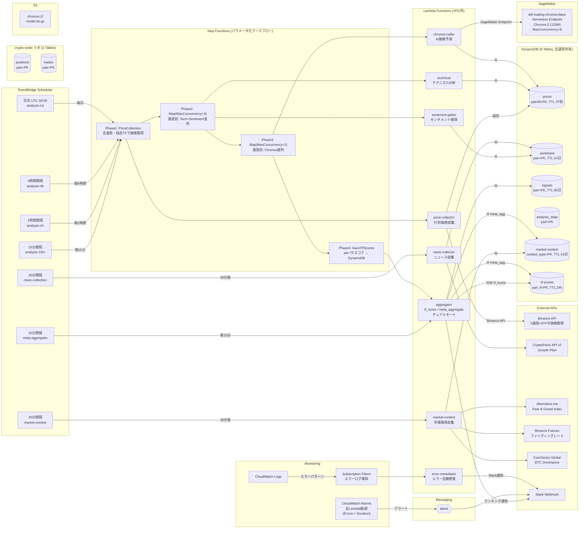

# アーキテクチャ設計書

Crypto Trader のシステム構成と技術選定を説明するドキュメントです。

- **売買戦略・ロジック**: [trading-strategy.md](trading-strategy.md)
- **Lambda関数リファレンス**: [lambda-reference.md](lambda-reference.md)

---

## システム構成図

> **推定コスト**: AWS 約$10/月 + CryptoPanic Growth $199/月（オプション）
> Lambda VPC外実行により NAT Gateway ($45/月) を削減



---

## 対応通貨

| 分析ペア (Binance) | 取引ペア (Coincheck) | CryptoPanic | 通貨名 |
|---|---|---|---|
| BTCUSDT | btc_jpy | BTC | Bitcoin |
| ETHUSDT | eth_jpy | ETH | Ethereum |
| XRPUSDT | xrp_jpy | XRP | XRP |

### なぜこの3通貨か

**選定基準**: Binance（分析用）と **Coincheck取引所**（取引用）の **両方で扱える** + **流動性が高い** + **取引所手数料0%** の通貨。マルチタイムフレーム分析のリソース効率を考慮し、最も流動性が高く分析意義のある3通貨に集中。

- 3通貨 × 4TF = 12分析ワークフロー（SageMaker同時実行制限に収まる）
- 通貨数を絞ることで各通貨の分析品質を向上
- `TRADING_PAIRS_CONFIG` 環境変数で通貨の追加・削除が可能（コード変更不要）

**参考 (Coincheck)**:
- [取引所手数料](https://coincheck.com/ja/exchange/fee) — 通貨別 Maker/Taker 手数料率
- [取引所 API](https://coincheck.com/ja/documents/exchange/api) — 利用可能な通貨ペア一覧、注文 API 仕様
- [取引注文ルール](https://faq.coincheck.com/s/article/40218?language=ja) — 最小注文数量・小数点以下桁数

---

## 設計原則

### 1. コスト最小化 — 月額 $10 以下

暗号通貨トレーディングボットは24時間365日稼働が必要だが、常にCPUリソースを使う必要はない。「イベント駆動 + Serverless」で、実際に処理が必要な時だけコストが発生する構成にしている。

### 2. 信頼性 — シグナルの確実な生成

分析パイプラインでは「シグナルを確実に生成・保存する」ことが最重要。DynamoDB signals テーブルに判定結果を永続化し、crypto-order リポジトリの order-executor が読み取り・執行。Lambda エラーは CloudWatch Alarm → Slack で即座に人間に通知。

### 3. シンプルさ — 運用負荷ゼロ

EC2 や ECS のようなサーバー管理は行わず、全てマネージドサービスで構成。パッチ適用、スケーリング、ログローテーションなどの運用作業が不要。

### 4. 拡張性 — 通貨追加がコード変更不要

DynamoDB は全テーブルが `pair` を Partition Key にしており、通貨追加はデータ層の変更不要。`TRADING_PAIRS_CONFIG` 環境変数を変更するだけで対応通貨を増減できる。

---

## 技術選定の理由

### Lambda vs EC2 vs ECS

| 選択肢 | メリット | デメリット | 採用 |
|---|---|---|---|
| EC2 | 柔軟性が高い | 常時課金、運用負荷 | ❌ |
| ECS Fargate | コンテナ実行 | 常時課金（最低$15/月） | ❌ |
| Lambda | 実行時のみ課金 | 15分制限、コールドスタート | ✅ |

- 各処理は数秒～数十秒で完了するため、15分制限は問題なし
- コールドスタートは許容範囲（数百ms、取引に影響なし）

### AI価格予測 (Chronos) のインフラ選定

スコアリング全体の **25%のウェイト** を占める AI 価格予測コンポーネントについて、以下の選択肢を比較検討した。

| 選択肢 | 方式 | 月額 | 推論時間 | 精度 | 運用負荷 |
|---|---|---|---|---|---|
| モメンタム代替 | Lambda 内計算 | $0 | <1秒 | ❌ 予測ではない | なし |
| Lambda + ONNX | Chronos-Tiny ONNX変換 | ~$0 | 3-10秒 | ⭕ | 中 |
| **SageMaker Serverless** | **Chronos-2 (120M)** | **~$3-8** | **2-5秒** | **◎** | **低（クォータ申請済）** |
| SageMaker Real-time | Chronos-Small (46M) | ~$50-80 | 1-3秒 | ◎ | 低 |
| ECS Fargate Spot | Chronos-Small コンテナ | ~$15-25 | 2-5秒 | ◎ | 中 |
| EC2 Spot GPU | Chronos-Large (710M) | ~$25-60 | <1秒 | ◎◎ | 高 |

**選定: SageMaker Serverless Endpoint（Chronos-2）**

初期は Lambda + ONNX Runtime (Chronos-Tiny 8M) → Chronos-T5-Base (200M) → 現在 Chronos-2 (120M) へ移行:
- **モデル更新**: T5-Base (200M) → Chronos-2 (120M) — 120Mパラメータでも250倍高速、10%高精度
- **推論方式**: 50回サンプリング → 分位数直接出力 (q10/q50/q90) — サンプリング不要で大幅高速化
- **入力データ量**: 336本 (28h) で日次サイクルのパターン認識強化
- **サーバーレス維持**: 推論リクエスト時のみ課金、アイドル時は0円
- **フォールバック**: SageMaker障害時はモメンタムベースの代替スコアに自動切替
- **デプロイスクリプト**: `scripts/deploy_sagemaker_chronos.py` で再デプロイ可能

#### SageMaker Serverless クォータ

| クォータ | 値 | 備考 |
|----------|-----|------|
| アカウント全体の最大同時実行数 | 10 | AWS Service Quotas で承認済 |
| エンドポイントの MaxConcurrency | 8 | 3通貨×4TF + マージン |
| Step Functions MaxConcurrency | 1 (Chronos) / 3 (分析) | Chronos直列でスロットリング防止 |

⚠️ **注意**: AWS クォータ（10）は「全Serverlessエンドポイントの MaxConcurrency 合計値の上限」であり、実際のエンドポイントの `MaxConcurrency` は別途設定が必要。

ECS/EC2 は常時課金が発生し、現行の「完全サーバーレス」設計思想に反する。

### VPC外実行

**削減コスト**: NAT Gateway $45/月 + Elastic IP $3.6/月 = **$48.6/月**

Lambda を VPC 内に配置すると、外部 API（Binance, CryptoPanic 等）へのアクセスに NAT Gateway が必須。しかし DynamoDB, SNS 等のAWSサービスは IAM 認証でアクセスでき、VPC内にある必要がない。

### Binance（分析） + Coincheck（取引）

| API | 価格データ | 取引 | 用途 |
|---|---|---|---|
| Binance | ✅ マルチTF OHLCV、無料 | ❌ 日本居住者不可 | 価格取得・分析 |
| Coincheck | ⚠️ 現在価格のみ | ✅ 日本円取引可 | 取引執行 |

テクニカル分析にはOHLC（始値・高値・安値・終値）が必要だが、CoincheckはOHLCを提供していない。

### マルチタイムフレーム分析間隔

| TF | 実行間隔 | 実行回数/日 | 月額概算 |
|---|---|---|---|
| 15m | 15分 | 96 | ~$0.15 |
| 1h | 1時間 | 24 | ~$0.04 |
| 4h | 4時間 | 6 | ~$0.01 |
| 1d | 日次 (UTC 00:05) | 1 | ~$0.002 |
| メタ集約 | 15分 | 96 | ~$0.02 |

- 各TFが独立したEventBridgeスケジュールでStep Functionsを起動
- メタアグリゲーターは15分毎に全TFスコアを読み取り、加重平均で最終判定

### Step Functions (4フェーズワークフロー)

```
EventBridge (TF別スケジュール: 15m/1h/4h/1d)
  └→ Step Functions (パラメータ: timeframe + pairs)
       └→ Phase 1: CollectPrices (Lambda)
       └→ Phase 2: Map [btc_usdt, eth_usdt, xrp_usdt] MaxConcurrency=3
            └→ Parallel: [テクニカル分析, センチメント取得]
       └→ Phase 3: Map [btc_usdt, eth_usdt, xrp_usdt] MaxConcurrency=1
            └→ Chronos推論 (直列: SageMaker同時リクエスト制限)
       └→ Phase 4: SaveTFScores (Aggregator tf_scoreモード)
```

- 4フェーズ構成: 価格収集 → Tech+Sent並列 → Chronos直列 → TFスコア保存
- ChronosのMaxConcurrency=1でSageMaker Serverlessのスロットリングを防止
- TF別のスコアはtf-scoresテーブルに保存、メタアグリゲーターが読み取り
- ワークフローの可視化・リトライ・エラーハンドリングを Step Functions が提供

### EventBridge → order-executor

```
aggregator (meta_aggregate) → DynamoDB (signalsテーブル) ← order-executor (crypto-orderリポ, EventBridge 15分毎)
```

aggregator が全 TF スコアを統合して BUY/SELL/HOLD 判定を DynamoDB signals テーブルに保存。order-executor (crypto-orderリポジトリで管理) が EventBridge 15分毎の定期起動で最新シグナルを読み取り、注文を執行。

### 監視・通知パイプライン

全 Lambda に CloudWatch Metric Alarms（Errors + Duration）を設定し、異常検知時は即座に Slack 通知。さらに、エラーログを自動検知して Slack に通知するパイプラインを構築。

```
CloudWatch Logs → Subscription Filter → error-remediator Lambda
                                            └→ Slack通知（エラー内容）
```

- **CloudWatch Alarms (18個)**: 全 9 Lambda × (Errors + Duration) で異常検知
- **Subscription Filters (8個)**: warm-up以外の全Lambdaのエラーログを検知
  - フィルターパターン: `?"[ERROR]" ?Traceback ?"raise Exception" -"[INFO]" -"expected behavior" -"retrying in"`
  - SageMaker Serverless の想定内リトライログ（ThrottlingException → 自動リカバリ）を除外
- **error-remediator Lambda**: エラー検知 → Slack通知（30分クールダウン付き）
### DynamoDB

| 選択肢 | メリット | デメリット | 採用 |
|---|---|---|---|
| RDS (PostgreSQL) | 柔軟なクエリ | 常時課金、VPC必須 | ❌ |
| Aurora Serverless | スケーラブル | 最低コスト高い | ❌ |
| DynamoDB | オンデマンド課金、TTL | NoSQLの制約 | ✅ |

- 全テーブルが `pair + timestamp` のシンプルなキー構造
- 複雑な JOIN やトランザクションは不要
- オンデマンドモードで使った分だけ課金
- TTL で古いデータを自動削除（ストレージコスト削減）

---

## DynamoDB テーブル設計

| テーブル | PK | SK | TTL | 用途 |
|---|---|---|---|---|
| prices | pair_tf (S) 例: btc_usdt#1h | timestamp (N) | TF別 (14d/30d/90d/250d) | 全通貨×全TFの価格履歴 |
| tf-scores | pair_tf (S) 例: btc_usdt#1h | timestamp (N) | 24時間 | TF別スコア保存 |
| sentiment | pair (S) | timestamp (N) | 14日 | 通貨別センチメントスコア |
| signals | pair (S) | timestamp (N) | 90日 | 分析シグナル履歴 |
| analysis_state | pair (S) | - | - | 通貨別の最終分析時刻 |
| market-context | context_type (S) | timestamp (N) | 14日 | マクロ市場環境指標 |

> positions / trades テーブルは [crypto-order](https://github.com/kiikun0530/crypto-order) リポジトリで管理

### TTL 設計の根拠

| テーブル | TTL | 理由 |
|---|---|---|
| prices (15m) | 14日 | 336本×15分 = 3.5日分、余裕あり |
| prices (1h) | 30日 | 336本×1h = 14日分、余裕あり |
| prices (4h) | 90日 | 336本×4h = 56日分、余裕あり |
| prices (1d) | 365日 | SMA200(250日)+余裕を持って1年分保持 |
| tf-scores | 24時間 | 最新スコアのみ必要、古いデータはstalenessで除外 |
| sentiment | 14日 | ニュース相関分析に2週間分必要 |
| signals | 90日 | パフォーマンス分析用に長めに保持 |
| analysis_state | なし | 分析状態は永続保存 |
| market-context | 14日 | マクロ指標は短期分のみ必要 |

---

## セキュリティ設計

| 認証情報 | 保存先 | 理由 |
|---|---|---|
| AWS認証 | IAMロール | Lambda実行ロールで自動付与 |
| CryptoPanic API | Lambda環境変数 | 読み取り専用、リスク低 |
| Slack Webhook | Lambda環境変数 | 読み取り専用、リスク低 |

> Coincheck API 認証情報は [crypto-order](https://github.com/kiikun0530/crypto-order) で Secrets Manager 管理

IAM ロールは最小権限原則で設計。各 Lambda は必要な DynamoDB テーブル・SNS のみアクセス可能。

---

## コスト内訳

### AWS費用（3通貨 × 4TF構成）

| 項目 | 月額 | 備考 |
|---|---|---|
| Lambda | ~$4.00 | 3通貨×4TF分析 + メタ集約 + error-remediator含む |
| DynamoDB | ~$0.30 | 8テーブル×3通貨×4TF分のR/W |
| Bedrock | ~$2.00 | Amazon Nova Micro センチメント分析 |
| SageMaker Serverless | ~$3-8 | Chronos-2 推論 (3通貨×4TF/周期) |
| Step Functions | ~$0.15 | 4TF別ワークフロー + メタ集約 |
| CloudWatch | ~$0.55 | ログ保存14日 + Metric Alarms + Subscription Filters |
| SNS/EventBridge | ~$0.05 | 軽微 |
| **AWS合計** | **~$10/月** | |

### 外部API費用

| API | 費用 | 備考 |
|---|---|---|
| Binance | 無料 | 3通貨×4TFの価格取得 + ファンディングレート（認証不要） |
| Alternative.me | 無料 | Fear & Greed Index |
| CoinGecko | 無料 | BTC Dominance |
| CryptoPanic | 無料 or $199/月 | Growth Plan でリアルタイム取得 |

> Coincheck 取引手数料は [crypto-order](https://github.com/kiikun0530/crypto-order) を参照

### 総コスト

| 構成 | 月額 |
|---|---|
| 無料プラン | **~$10/月** |
| Growth Plan | **~$209/月** |

> crypto-order側のコスト（Secrets Manager等）は別途

---

## 関連ドキュメント

- [trading-strategy.md](trading-strategy.md) — マルチTF戦略、スコアリング、売買判定
- [lambda-reference.md](lambda-reference.md) — 各Lambda関数の仕様、I/O、設定
- [crypto-order](https://github.com/kiikun0530/crypto-order) — 注文実行・ポジション管理
