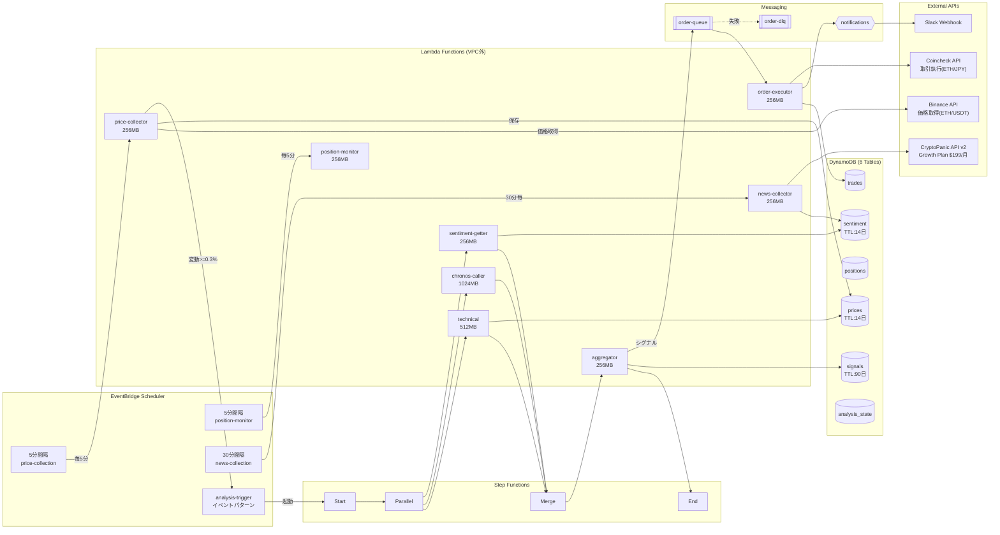

# アーキテクチャ設計書

このドキュメントは、Crypto Traderの設計思想と各技術選定の理由を説明します。

---

## システム構成図

> **推定コスト**: AWS約$4-5/月 + CryptoPanic Growth $199/月（オプション）  
> Lambda VPC外実行により NAT Gateway ($45/月) を削減



---

## 設計原則

### 1. コスト最小化

**目標**: 月額 $10 以下での運用

暗号通貨トレーディングボットは24時間365日稼働が必要ですが、常にCPUリソースを使う必要はありません。「イベント駆動」と「Serverless」を組み合わせることで、実際に処理が必要な時だけコストが発生する構成にしています。

### 2. 信頼性

**目標**: 注文の確実な実行

金融取引では「注文を出したつもりが出ていなかった」という事態が最も危険です。SQS + DLQ（Dead Letter Queue）の組み合わせにより、失敗した注文の追跡と再試行を保証しています。

### 3. シンプルさ

**目標**: 運用負荷ゼロ

EC2やECSのようなサーバー管理は行わず、全てマネージドサービスで構成。パッチ適用、スケーリング、ログローテーションなどの運用作業が不要です。

---

## 技術選定の理由

### なぜ AWS Lambda か

| 選択肢 | メリット | デメリット | 採用 |
|--------|----------|------------|------|
| EC2 | 柔軟性が高い | 常時課金、運用負荷 | ❌ |
| ECS Fargate | コンテナ実行 | 常時課金（最低$15/月） | ❌ |
| Lambda | 実行時のみ課金 | 15分制限、コールドスタート | ✅ |

**判断理由**:
- 各処理は数秒〜1分で完了するため、15分制限は問題なし
- 1日あたりの実行回数から計算すると、Lambdaが圧倒的にコスト効率が良い
- コールドスタートは許容範囲（数百ms程度、取引に影響なし）

### なぜ VPC外で Lambda を実行するか

**削減コスト**: NAT Gateway $45/月 + Elastic IP $3.6/月 = **$48.6/月**

Lambda が VPC 内にある場合、外部 API（Binance、Coincheck、CryptoPanic）へのアクセスに NAT Gateway が必要です。しかし：

- DynamoDB、S3、SQS、SNS は **VPC エンドポイント** または **IAM ロール** でアクセス可能
- 外部 API は **パブリックインターネット** 経由でアクセス
- Secrets Manager の認証情報は **IAM ロール** で保護

つまり、VPC 内に配置する理由がありません。VPC 外で実行することで、NAT Gateway のコストを完全に削除しました。

### なぜ Binance で価格取得、Coincheck で取引か

| API | 価格データ | 取引 | 採用用途 |
|-----|-----------|------|----------|
| Binance | ✅ 5分足OHLC、無料、豊富 | ❌ 日本居住者取引不可 | 価格取得 |
| Coincheck | ⚠️ 現在価格のみ | ✅ 日本円で取引可能 | 取引執行 |

**判断理由**:
- テクニカル分析には OHLC（始値・高値・安値・終値）データが必要
- Coincheck は現在価格のみ提供、過去データの取得が困難
- Binance は無料で高品質な OHLC データを提供（API制限も緩い）
- 取引は日本の法規制上、金融庁登録業者の Coincheck を使用
- ETH/USDT（Binance）→ ETH/JPY（Coincheck）の価格差は aggregator で吸収

### なぜ 5分間隔か

| 間隔 | Lambda実行回数/日 | 月額コスト概算 | メリット |
|------|------------------|----------------|----------|
| 1分 | 1,440 | ~$3 | リアルタイム性高い |
| 5分 | 288 | **~$0.6** | バランス良好 |
| 15分 | 96 | ~$0.2 | コスト最小 |

**判断理由**:
- 暗号通貨市場は株式より変動が大きいが、1分間隔は過剰
- 5分間隔でも十分なトレード機会を捉えられる
- SMA200計算には最低1000分（約17時間）のデータが必要 → 5分足で十分
- EventBridge のイベント駆動により、急変時は即座に分析開始可能

### なぜ Step Functions か

```
価格変動検知 → [並列] テクニカル分析
                      Chronos予測
                      センチメント取得 → 結果統合 → シグナル生成
```

**判断理由**:
- 3つの分析を **並列実行** することで、レイテンシを1/3に削減
- Lambda の直接連鎖だと、途中で失敗した場合の状態管理が複雑
- Step Functions はワークフローの **可視化** と **リトライ** を提供
- 分析結果を次のステップに自動的に渡せる

### なぜ EventBridge + イベントパターンか

```hcl
event_pattern = {
  source      = ["eth-trading.price-collector"]
  detail-type = ["analysis-required"]
}
```

**判断理由**:
- price-collector が「分析が必要」と判断した時のみ Step Functions を起動
- 無駄な分析を削減（価格が安定している時は分析しない）
- **変動閾値 0.3%** を超えた場合のみイベント発火
- EventBridge のルールで柔軟にトリガー条件を変更可能

### なぜ SQS + DLQ か

```
aggregator → SQS(order-queue) → order-executor
                    ↓ (3回失敗)
              SQS(order-dlq) → CloudWatch Alarm → Slack通知
```

**判断理由**:
- 注文は **絶対に失落させてはいけない** 処理
- SQS は自動リトライ（3回）を提供
- DLQ で失敗した注文を捕捉し、Slack に即座に通知
- Lambda の直接呼び出しだと、失敗時の追跡が困難

### なぜ DynamoDB か

| 選択肢 | メリット | デメリット | 採用 |
|--------|----------|------------|------|
| RDS (PostgreSQL) | 柔軟なクエリ | 常時課金、VPC必須 | ❌ |
| Aurora Serverless | スケーラブル | 最低コスト高い | ❌ |
| DynamoDB | オンデマンド課金、TTL | NoSQLの制約 | ✅ |

**判断理由**:
- 価格データは「pair + timestamp」のシンプルなキーでアクセス
- 複雑な JOIN やトランザクションは不要
- **オンデマンドモード** で、使った分だけ課金
- **TTL** で古いデータを自動削除（ストレージコスト削減）

### TTL 設計

| テーブル | TTL | 理由 |
|----------|-----|------|
| prices | 14日 | SMA200に必要な最低データ量を保持 |
| sentiment | 14日 | ニュース相関分析に2週間分必要 |
| signals | 90日 | パフォーマンス分析用に長めに保持 |
| positions | なし | 取引履歴は永続保存（税務対応） |
| trades | なし | 取引履歴は永続保存（税務対応） |

---

## 分析ロジックの設計

### スコア統合

```
final_score = technical × 0.40 + chronos × 0.40 + sentiment × 0.20
```

| 分析種別 | 重み | 理由 |
|----------|------|------|
| テクニカル | 40% | Binance 5分足OHLC、リアルタイム性高い |
| Chronos予測 | 40% | Amazon Chronos による時系列予測 |
| センチメント | 20% | CryptoPanic Growth Plan でリアルタイムニュース取得 |

**判断理由**:
- テクニカル指標（SMA、RSI等）は即座に市場を反映
- AI予測は過去パターンからの推測だが、価格ベースで信頼性あり
- センチメントは Growth Plan（$199/月）でリアルタイムデータ取得可能なため、重みを20%に設定
- ニュース→市場反映には時間差があるため、センチメントは補助的な位置づけ

> **Note**: 無料プラン使用時はセンチメントの重みを 10-15% に下げることを推奨

### スコア連動投資

| スコア | 投資比率 | 理由 |
|--------|----------|------|
| 0.90+ | 100% | 強いシグナル、フルポジション |
| 0.80-0.90 | 75% | 高確度、メインポジション |
| 0.70-0.80 | 50% | 中程度、ハーフポジション |
| 0.65-0.70 | 30% | 弱いシグナル、小ポジション |
| 0.65未満 | 0% | 見送り |

**判断理由**:
- 「期待値に比例した投資」が資金効率を最大化
- 弱いシグナルでも少額で参加することで機会損失を防ぐ
- 強いシグナルで大きく張ることでリターンを最大化

---

## 将来の拡張性

### ECS 追加時の構成

現在は Amazon Chronos を Lambda 内で簡易実行していますが、本格的な AI 予測を行う場合は ECS Fargate の追加を検討：

```
追加コスト: ~$67/月
- ECS Fargate (Chronos): ~$15
- ECS Fargate (FinBERT): ~$2
- ALB (内部): ~$5
- NAT Gateway (必須): ~$45
```

VPC との接続が必要なリソースが増えると、NAT Gateway が必要になります。

### マルチ通貨対応

現在は ETH のみ対応ですが、以下の変更で複数通貨に対応可能：

1. DynamoDB の `pair` キーを活用（既に設計済み）
2. EventBridge ルールを通貨ごとに追加
3. Lambda 環境変数で通貨設定

---

## セキュリティ設計

### 認証情報の管理

| 認証情報 | 保存先 | アクセス方法 |
|----------|--------|--------------|
| AWS認証 | IAMロール | Lambda実行ロール |
| Coincheck API | Secrets Manager | GetSecretValue |
| CryptoPanic API | Lambda環境変数 | 暗号化済み |
| Slack Webhook | Lambda環境変数 | 暗号化済み |

**判断理由**:
- Coincheck API は取引に直結するため、Secrets Manager で厳重管理
- CryptoPanic/Slack は読み取り専用のため、環境変数で簡易管理
- IAM ロールは最小権限原則で設計

---

## 監視・アラート設計

### CloudWatch Alarms

| アラーム | 条件 | 通知先 |
|----------|------|--------|
| DLQ滞留 | メッセージ数 > 0 | Slack |
| Lambda エラー | エラー率 > 5% | Slack |
| DynamoDB スロットリング | ThrottledRequests > 0 | Slack |

**判断理由**:
- DLQ に注文が滞留 = 重大インシデント（即座に人間が対応）
- Lambda エラーは一時的なものが多いが、継続する場合は調査が必要
- DynamoDB スロットリングは容量不足の兆候

---

## コスト内訳（計算式付き）

### Lambda 費用

**料金体系** (ap-northeast-1):
- 実行時間: $0.0000166667/GB-秒
- リクエスト: $0.20/100万リクエスト

| 関数 | メモリ | 実行時間 | 頻度 | GB-秒/月 | 計算式 |
|------|--------|----------|------|----------|--------|
| price-collector | 256MB | 30s | 288回/日 | 64,800 | 0.25GB × 30s × 288 × 30日 |
| position-monitor | 256MB | 30s | 288回/日 | 64,800 | 0.25GB × 30s × 288 × 30日 |
| news-collector | 256MB | 60s | 48回/日 | 21,600 | 0.25GB × 60s × 48 × 30日 |
| technical | 512MB | 60s | 10回/日 | 9,000 | 0.5GB × 60s × 10 × 30日 |
| chronos-caller | 1024MB | 120s | 10回/日 | 36,000 | 1GB × 120s × 10 × 30日 |
| sentiment-getter | 256MB | 60s | 10回/日 | 4,500 | 0.25GB × 60s × 10 × 30日 |
| aggregator | 256MB | 60s | 10回/日 | 4,500 | 0.25GB × 60s × 10 × 30日 |
| order-executor | 256MB | 30s | 5回/日 | 1,125 | 0.25GB × 30s × 5 × 30日 |
| **合計** | | | | **206,325** | |

```
Lambda費用 = 206,325 GB-秒 × $0.0000166667 = $3.44/月
リクエスト = ~20,000回 × $0.0000002 = $0.004/月
```

### その他AWSサービス

| サービス | 計算式 | 月額 |
|----------|--------|------|
| DynamoDB (オンデマンド) | ~100K R/W × $0.00000125 | ~$0.15 |
| Step Functions | ~300回 × 6遷移 × $0.000025 | ~$0.05 |
| SQS | ~5,000メッセージ × $0.0000004 | ~$0.002 |
| SNS | ~1,000通知 × $0.0000005 | ~$0.0005 |
| EventBridge | ~10,000イベント × $0.000001 | ~$0.01 |
| CloudWatch Logs | ~50MB × $0.76/GB | ~$0.04 |
| Secrets Manager | 1シークレット × $0.40 + API | ~$0.50 |

### AWS費用まとめ

| 項目 | 月額 |
|------|------|
| Lambda 実行 | $3.44 |
| DynamoDB | $0.15 |
| Step Functions | $0.05 |
| CloudWatch | $0.04 |
| Secrets Manager | $0.50 |
| その他 | $0.02 |
| **AWS合計** | **~$4.20/月** |

### 外部API費用

| API | 費用 | 備考 |
|-----|------|------|
| Binance | 無料 | 価格データ取得のみ（認証不要） |
| CryptoPanic | $199/月 | Growth Plan（無料プランでも動作可） |
| Coincheck | 0% | 取引手数料無料 |

### 総コスト

| 構成 | 月額 |
|------|------|
| 無料プラン構成 | **~$4-5/月** |
| Growth Plan構成 | **~$203-205/月** |

---

## まとめ

このアーキテクチャは以下を実現しています：

1. **AWSインフラ $3-6/月** のコスト効率（外部API費用別）
2. **VPC外実行** による NAT Gateway コスト削減
3. **イベント駆動** による無駄な処理の削減
4. **SQS + DLQ** による注文の確実な実行
5. **Step Functions** による並列分析と可視化
6. **DynamoDB TTL** によるストレージコスト最適化
7. **スコア連動投資** による資金効率の最大化

設計の根拠が明確であれば、将来の拡張や修正も容易になります。
