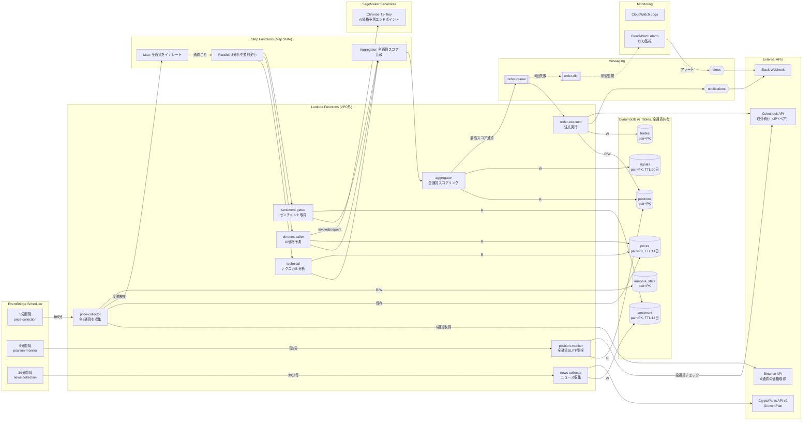

# アーキテクチャ設計書

Crypto Trader のシステム構成と技術選定を説明するドキュメントです。

- **売買戦略・ロジック**: [trading-strategy.md](trading-strategy.md)
- **Lambda関数リファレンス**: [lambda-reference.md](lambda-reference.md)

---

## システム構成図

> **推定コスト**: AWS 約$9-14/月 + CryptoPanic Growth $199/月（オプション）
> Lambda VPC外実行により NAT Gateway ($45/月) を削減



---

## 対応通貨

| 分析ペア (Binance) | 取引ペア (Coincheck) | CryptoPanic | 通貨名 |
|---|---|---|---|
| ETHUSDT | eth_jpy | ETH | Ethereum |
| BTCUSDT | btc_jpy | BTC | Bitcoin |
| XRPUSDT | xrp_jpy | XRP | XRP |
| SOLUSDT | sol_jpy | SOL | Solana |
| DOGEUSDT | doge_jpy | DOGE | Dogecoin |
| AVAXUSDT | avax_jpy | AVAX | Avalanche |

### なぜこの6通貨か

**選定基準**: Binance（分析用）と **Coincheck取引所**（取引用）の **両方で扱える** + **流動性が高い** + **取引所手数料0%** の通貨

- 日本の法規制上、取引は金融庁登録業者（Coincheck）で行う必要がある
- Coincheck「販売所」はスプレッドが大きいため、**取引所**で売買可能な通貨のみ選定
- テクニカル分析用のOHLCデータは Binance の方が高品質かつ無料
- 6通貨は分析コスト（Lambda 18回/分析）と網羅性のバランスが良い
- 10通貨以上にすると CryptoPanic API レスポンスが肥大化し、Lambda実行時間が増加
- `TRADING_PAIRS_CONFIG` 環境変数で通貨の追加・削除が可能（コード変更不要）

**参考 (Coincheck)**:
- [取引所手数料](https://coincheck.com/ja/exchange/fee) — 通貨別 Maker/Taker 手数料率
- [取引所 API](https://coincheck.com/ja/documents/exchange/api) — 利用可能な通貨ペア一覧、注文 API 仕様
- [取引注文ルール](https://faq.coincheck.com/s/article/40218?language=ja) — 最小注文数量・小数点以下桁数

---

## 設計原則

### 1. コスト最小化 — 月額 $10 以下

暗号通貨トレーディングボットは24時間365日稼働が必要だが、常にCPUリソースを使う必要はない。「イベント駆動 + Serverless」で、実際に処理が必要な時だけコストが発生する構成にしている。

### 2. 信頼性 — 注文の確実な実行

金融取引では「注文を出したつもりが出ていなかった」が最も危険。SQS + DLQ で失敗した注文の追跡と再試行を保証。DLQ 滞留時は CloudWatch Alarm → Slack で即座に人間に通知。

### 3. シンプルさ — 運用負荷ゼロ

EC2 や ECS のようなサーバー管理は行わず、全てマネージドサービスで構成。パッチ適用、スケーリング、ログローテーションなどの運用作業が不要。

### 4. 拡張性 — 通貨追加がコード変更不要

DynamoDB は全テーブルが `pair` を Partition Key にしており、通貨追加はデータ層の変更不要。`TRADING_PAIRS_CONFIG` 環境変数を変更するだけで対応通貨を増減できる。

---

## 技術選定の理由

### Lambda vs EC2 vs ECS

| 選択肢 | メリット | デメリット | 採用 |
|---|---|---|---|
| EC2 | 柔軟性が高い | 常時課金、運用負荷 | ❌ |
| ECS Fargate | コンテナ実行 | 常時課金（最低$15/月） | ❌ |
| Lambda | 実行時のみ課金 | 15分制限、コールドスタート | ✅ |

- 各処理は数秒～数十秒で完了するため、15分制限は問題なし
- コールドスタートは許容範囲（数百ms、取引に影響なし）

### AI価格予測 (Chronos) のインフラ選定

スコアリング全体の **40%のウェイト** を占める AI 価格予測コンポーネントについて、以下の選択肢を比較検討した。

| 選択肢 | 方式 | 月額 | 推論時間 | 精度 | 運用負荷 |
|---|---|---|---|---|---|
| モメンタム代替 | Lambda 内計算 | $0 | <1秒 | ❌ 予測ではない | なし |
| **SageMaker Serverless** | **Chronos-Tiny (8M)** | **~$3-8** | **5-15秒** | **⭕** | **なし** |
| SageMaker Real-time | Chronos-Small (46M) | ~$50-80 | 1-3秒 | ◎ | 低 |
| ECS Fargate Spot | Chronos-Small コンテナ | ~$15-25 | 2-5秒 | ◎ | 中 |
| Lambda + ONNX | Chronos-Tiny ONNX変換 | ~$1-3 | 3-10秒 | ⭕ | 高（実装複雑） |
| EC2 Spot GPU | Chronos-Large (710M) | ~$25-60 | <1秒 | ◎◎ | 高 |

**選定: SageMaker Serverless Inference（Chronos-T5-Tiny）**

スモールスタートの観点から採用:
- **マネージド**: インフラ管理ゼロ（ECS/EC2不要）、Lambda同様に運用負荷なし
- **従量課金**: リクエスト時のみ課金（5分×6通貨=1日1,728回 → ~$3-8/月）
- **現行コストへの影響が最小**: $6/月 → ~$9-14/月（+50-130%だが絶対額は小さい）
- **段階的アップグレード可能**: Tiny → Small → Large へモデル変更だけでスケール
- **Serverless自動スケール**: トラフィックに応じてインスタンスを自動起動/停止
- **フォールバック**: SageMaker障害時はモメンタムベースの代替スコアに自動切替

Lambda + ONNX は最もコスト効率が良いが、モデル変換・Layer サイズ制限の技術的障壁が高い。ECS/EC2 は常時課金が発生し、現行の「完全サーバーレス」設計思想に反する。

### VPC外実行

**削減コスト**: NAT Gateway $45/月 + Elastic IP $3.6/月 = **$48.6/月**

Lambda を VPC 内に配置すると、外部 API（Binance, Coincheck, CryptoPanic）へのアクセスに NAT Gateway が必須。しかし DynamoDB, SQS, SNS 等のAWSサービスは IAM 認証でアクセスでき、VPC内にある必要がない。Coincheck の API キーは Secrets Manager（IAMロール保護）で管理。

### Binance（分析） + Coincheck（取引）

| API | 価格データ | 取引 | 用途 |
|---|---|---|---|
| Binance | ✅ 5分足OHLC、無料 | ❌ 日本居住者不可 | 価格取得・分析 |
| Coincheck | ⚠️ 現在価格のみ | ✅ 日本円取引可 | 取引執行 |

テクニカル分析にはOHLC（始値・高値・安値・終値）が必要だが、CoincheckはOHLCを提供していない。

### 5分間隔

| 間隔 | 実行回数/日 | 月額概算 |
|---|---|---|
| 1分 | 1,440 | ~$3 |
| **5分** | **288** | **~$0.6** |
| 15分 | 96 | ~$0.2 |

- SMA200 に必要な最低データ量（約17時間分）を 5分足で十分カバー
- 急変時は変動閾値（0.3%）を超えた時点で即座に分析開始
- 1分間隔は暗号通貨のボラティリティに対して過剰

### Step Functions (Map State)

```
price-collector
  └→ Step Functions
       └→ Map: [eth_usdt, btc_usdt, xrp_usdt, sol_usdt, doge_usdt, avax_usdt]
            └→ Parallel: [テクニカル分析, AI予測, センチメント取得]
       └→ Aggregator: 全通貨のスコアを比較 → 最高期待値の通貨を選定
```

- Map State で全通貨を **並列分析** → 6通貨×3分析 = 18 Lambda が並列実行
- ワークフローの可視化・リトライ・エラーハンドリングを Step Functions が提供
- Lambda の直接連鎖だと失敗時の状態管理が複雑

### SQS + DLQ

```
aggregator → SQS(order-queue) → order-executor
                    ↓ (3回失敗)
              SQS(order-dlq) → CloudWatch Alarm → Slack通知
```

注文は絶対に失落させてはいけない。SQS は自動リトライ（3回）を提供し、DLQ で失敗した注文を捕捉して即座に通知。

### DynamoDB

| 選択肢 | メリット | デメリット | 採用 |
|---|---|---|---|
| RDS (PostgreSQL) | 柔軟なクエリ | 常時課金、VPC必須 | ❌ |
| Aurora Serverless | スケーラブル | 最低コスト高い | ❌ |
| DynamoDB | オンデマンド課金、TTL | NoSQLの制約 | ✅ |

- 全テーブルが `pair + timestamp` のシンプルなキー構造
- 複雑な JOIN やトランザクションは不要
- オンデマンドモードで使った分だけ課金
- TTL で古いデータを自動削除（ストレージコスト削減）

---

## DynamoDB テーブル設計

| テーブル | PK | SK | TTL | 用途 |
|---|---|---|---|---|
| prices | pair (S) | timestamp (N) | 14日 | 全通貨の価格履歴 |
| sentiment | pair (S) | timestamp (N) | 14日 | 通貨別センチメントスコア |
| signals | pair (S) | timestamp (N) | 90日 | 分析シグナル履歴 |
| positions | pair (S) | position_id (S) | - | ポジション管理 |
| trades | pair (S) | timestamp (N) | - | 取引履歴（永続・税務対応） |
| analysis_state | pair (S) | - | - | 通貨別の最終分析時刻 |

### TTL 設計の根拠

| テーブル | TTL | 理由 |
|---|---|---|
| prices | 14日 | SMA200 に必要な最低データ量を保持 |
| sentiment | 14日 | ニュース相関分析に2週間分必要 |
| signals | 90日 | パフォーマンス分析用に長めに保持 |
| positions | なし | 取引履歴は永続保存（税務対応） |
| trades | なし | 取引履歴は永続保存（税務対応） |

---

## セキュリティ設計

| 認証情報 | 保存先 | 理由 |
|---|---|---|
| AWS認証 | IAMロール | Lambda実行ロールで自動付与 |
| Coincheck API | Secrets Manager | 取引に直結するため厳重管理 |
| CryptoPanic API | Lambda環境変数 | 読み取り専用、リスク低 |
| Slack Webhook | Lambda環境変数 | 読み取り専用、リスク低 |

IAM ロールは最小権限原則で設計。各 Lambda は必要な DynamoDB テーブル・SQS・SNS のみアクセス可能。

---

## コスト内訳

### AWS費用（6通貨構成）

| 項目 | 月額 | 備考 |
|---|---|---|
| Lambda | ~$5.00 | 6通貨分析で旧ETHのみの約1.5倍 |
| DynamoDB | ~$0.30 | 6テーブル×6通貨分のR/W |
| SageMaker Serverless | ~$3-8 | Chronos-T5-Tiny AI価格予測 |
| Step Functions | ~$0.10 | Map State で遷移数増加 |
| CloudWatch | ~$0.05 | ログ保存14日 |
| Secrets Manager | ~$0.50 | 1シークレット |
| SQS/SNS/EventBridge | ~$0.05 | 軽微 |
| **AWS合計** | **~$9-14/月** | |

### 外部API費用

| API | 費用 | 備考 |
|---|---|---|
| Binance | 無料 | 6通貨分の価格取得（認証不要） |
| CryptoPanic | 無料 or $199/月 | Growth Plan でリアルタイム取得 |
| Coincheck | 0% | 取引手数料無料 |

### 総コスト

| 構成 | 月額 |
|---|---|
| 無料プラン | **~$9-14/月** |
| Growth Plan | **~$208-213/月** |

---

## 関連ドキュメント

- [trading-strategy.md](trading-strategy.md) — マルチ通貨選定ロジック、スコアリング、売買判定
- [lambda-reference.md](lambda-reference.md) — 各Lambda関数の仕様、I/O、設定
