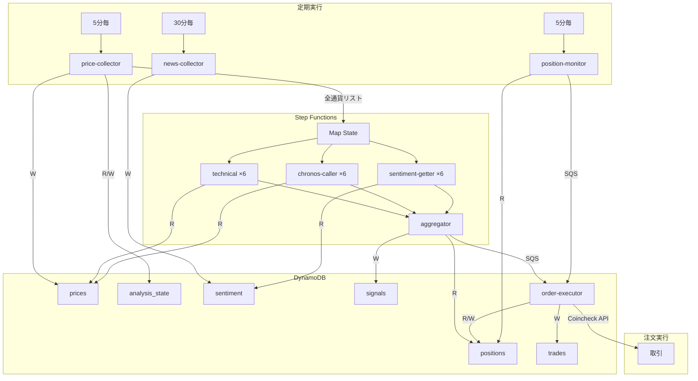

# Lambda関数リファレンス

全9つの Lambda 関数の仕様、入出力、設定の詳細。

---

## 全Lambda共通

### 共通環境変数

| 変数名 | 用途 |
|---|---|
| `PRICES_TABLE` | 価格テーブル名 |
| `SENTIMENT_TABLE` | センチメントテーブル名 |
| `POSITIONS_TABLE` | ポジションテーブル名 |
| `TRADES_TABLE` | 取引テーブル名 |
| `SIGNALS_TABLE` | シグナルテーブル名 |
| `ANALYSIS_STATE_TABLE` | 分析状態テーブル名 |
| `COINCHECK_SECRET_ARN` | Coincheck API認証情報のARN |
| `STEP_FUNCTION_ARN` | Step Functions ARN |
| `ORDER_QUEUE_URL` | SQS注文キューURL |
| `SLACK_WEBHOOK_URL` | Slack通知用Webhook |
| `TRADING_PAIRS_CONFIG` | 通貨ペア設定JSON |
| `MODEL_BUCKET` | ONNXモデル格納S3バケット |
| `MODEL_PREFIX` | ONNXモデルのS3プレフィックス |
| `CRYPTOPANIC_API_KEY` | CryptoPanic APIキー |
| `VOLATILITY_THRESHOLD` | 変動閾値（%） |
| `MAX_POSITION_JPY` | 最大ポジション額（円） |

### 通貨ペア設定 (TRADING_PAIRS_CONFIG)

```json
{
  "eth_usdt": {
    "binance": "ETHUSDT",
    "coincheck": "eth_jpy",
    "news": "ETH",
    "name": "Ethereum"
  },
  "btc_usdt": {
    "binance": "BTCUSDT",
    "coincheck": "btc_jpy",
    "news": "BTC",
    "name": "Bitcoin"
  }
}
```

- `binance`: Binance APIのシンボル名（価格取得用）
- `coincheck`: Coincheck APIのペア名（取引執行用）
- `news`: CryptoPanic APIの通貨コード（ニュース取得用）
- `name`: Slack通知等に使う表示名

---

## price-collector

5分間隔で全通貨の価格を Binance から収集し、変動を検知して分析をトリガー。

| 項目 | 値 |
|---|---|
| トリガー | EventBridge (5分間隔) |
| メモリ | 256MB |
| タイムアウト | 60秒 |
| DynamoDB | prices (W), analysis_state (R/W) |

### 処理フロー

1. `TRADING_PAIRS_CONFIG` から全通貨ペアを取得
2. 各通貨について Binance API から5分足終値を取得
3. DynamoDB `prices` テーブルに保存
4. 1時間前の価格と比較して変動率を計算
5. いずれかの通貨が変動閾値(0.3%)超え、または1時間経過 → Step Functions 起動
6. **全通貨のペアリスト** を Step Functions に渡す（個別ではなく一括分析）

### 出力

```json
{
  "statusCode": 200,
  "body": {
    "pairs_collected": 6,
    "triggered": 2,
    "analysis_started": true
  }
}
```

### Step Functions への入力

```json
{
  "pairs": ["eth_usdt", "btc_usdt", "xrp_usdt", "sol_usdt", "doge_usdt", "avax_usdt"],
  "timestamp": 1770523800,
  "trigger_reasons": ["volatility", "periodic"]
}
```

---

## technical

DynamoDB から価格履歴を読み取り、テクニカル指標を計算してスコアを返す。

| 項目 | 値 |
|---|---|
| トリガー | Step Functions (Map > Parallel) |
| メモリ | 512MB |
| タイムアウト | 60秒 |
| DynamoDB | prices (R) |

### 入力

```json
{
  "pair": "eth_usdt",
  "timestamp": 1770523800
}
```

### 出力

```json
{
  "pair": "eth_usdt",
  "technical_score": 0.432,
  "indicators": {
    "rsi": 45.23,
    "macd": 0.0012,
    "macd_signal": 0.0008,
    "sma_20": 2345.67,
    "sma_200": 2300.00,
    "bb_upper": 2400.00,
    "bb_lower": 2290.00,
    "golden_cross": true
  },
  "current_price": 2350.50
}
```

### 分析指標

| 指標 | パラメータ | スコアへの影響 |
|---|---|---|
| RSI | 14期間 | <30: 買い、>70: 売り |
| MACD | (12,26,9) | シグナルクロスで判定 |
| SMA | 20, 200 | ゴールデン/デッドクロス |
| Bollinger | (20,2) | バンド位置で判定 |

---

## chronos-caller

ONNX Runtime で Amazon Chronos-T5-Tiny を実行し、AI 価格予測を行う。ONNX モデルは S3 から /tmp にダウンロード＆キャッシュ。推論失敗時はモメンタムベースの代替スコアにフォールバック。

| 項目 | 値 |
|---|---|
| トリガー | Step Functions (Map > Parallel) |
| メモリ | 1536MB |
| タイムアウト | 120秒 |
| DynamoDB | prices (R) |
| S3 | chronos-onnx/ (ONNXモデル読み取り) |
| Lambda Layer | onnxruntime + numpy |

### 動作モード

| ONNX モデル | 動作 |
|---|---|
| S3にモデルあり | ONNX Runtime で AI 価格予測（12ステップ先） |
| モデル読み込み失敗 | モメンタムベーススコア（短期60% + 中期40%）にフォールバック |

### ONNX モデルのセットアップ

```bash
# 1. ONNX変換（要: torch, transformers, chronos-forecasting, optimum）
pip install torch transformers chronos-forecasting optimum[onnxruntime]
python scripts/convert_chronos_onnx.py

# 2. S3にアップロード
aws s3 sync models/chronos-onnx/ s3://eth-trading-sagemaker-models-<ACCOUNT_ID>/chronos-onnx/
```

### 予測 → スコア変換

予測系列の加重平均（遠い将来ほど重みが大きい）と現在価格の変化率から算出:
- `change_percent = (weighted_avg - current_price) / current_price × 100`
- ±3% の変動予測で ±1.0 にスケール

### 出力

```json
{
  "pair": "eth_usdt",
  "chronos_score": 0.312,
  "prediction": [2355.2, 2361.8, 2358.5, ...],
  "current_price": 2350.50
}
```

---

## sentiment-getter

DynamoDB から最新のセンチメントスコアを取得して返す。

| 項目 | 値 |
|---|---|
| トリガー | Step Functions (Map > Parallel) |
| メモリ | 256MB |
| タイムアウト | 60秒 |
| DynamoDB | sentiment (R) |

### 出力

```json
{
  "pair": "eth_usdt",
  "sentiment_score": 0.65,
  "last_updated": 1770522000,
  "source": "cryptopanic"
}
```

---

## news-collector

CryptoPanic API から全通貨のニュースを取得し、通貨別にセンチメント分析してDynamoDBに保存。

| 項目 | 値 |
|---|---|
| トリガー | EventBridge (30分間隔) |
| メモリ | 256MB |
| タイムアウト | 60秒 |
| DynamoDB | sentiment (W) |
| 外部API | CryptoPanic (2 calls/実行) |

### API最適化

```
1回目: ?currencies=ETH,BTC,XRP,DOT,LINK,AVAX  → 全通貨ニュース一括
2回目: (通貨指定なし)                          → 全体市場ニュース
合計: 2 API calls × 48回/日 × 30日 = 2,880/月 (Growth Plan 3,000内)
```

### 通貨マッチング

CryptoPanic API v2 (Growth Plan) では、記事の通貨情報が `instruments` フィールドに格納される（v1の `currencies` もフォールバック対応）。

```json
"instruments": [{"code": "ETH", "title": "Ethereum", ...}]
```

### 通貨別センチメント計算

| ニュース種別 | 重み | 適用 |
|---|---|---|
| 直接関連 (例: ETHニュースをETHに) | ×1.0 | 対象通貨のみ |
| BTC相関 (BTCニュースを他通貨に) | ×0.5 | BTC以外の通貨 |
| 全体市場ニュース | ×0.3 | 全通貨 |

### センチメントスコアの決定

| 優先度 | 条件 | スコア決定方法 |
|---|---|---|
| 1 | 投票数 ≥ 5 | 賛否比率 × 信頼度係数 |
| 2 | 投票数 < 5 | タイトルキーワード分析（強気/弱気語検出） |
| 補助 | `panic_score` 存在時 | ±0.10 の微調整（0=ネガ, 2=中立, 4=ポジ） |

**タイトルキーワード分析**: surge, rally, breakout 等の強気語と crash, plunge, hack 等の弱気語を検出し、キーワード1つにつき±0.1（最大±0.3）をスコアに加算。

---

## aggregator

全通貨の分析結果を統合、スコアランキングを作成し、最適な売買判定を行う。

| 項目 | 値 |
|---|---|
| トリガー | Step Functions (Map完了後) |
| メモリ | 512MB |
| タイムアウト | 120秒 |
| DynamoDB | signals (W), positions (R) |

### 入力 (Step Functions Map の出力)

```json
{
  "analysis_results": [
    {
      "pair": "eth_usdt",
      "technical": {"technical_score": 0.65, ...},
      "chronos": {"chronos_score": 0.45, ...},
      "sentiment": {"sentiment_score": 0.72, ...}
    },
    ...
  ]
}
```

### 処理フロー

1. 各通貨の加重平均スコアを計算
2. BB幅（ボリンジャーバンド幅）からボラティリティ適応型閾値を計算
   - `vol_ratio = avg_bb_width / baseline(0.03)` → クランプ 0.5〜2.0
   - `buy_threshold = 0.20 × vol_ratio`, `sell_threshold = -0.20 × vol_ratio`
3. 全通貨のシグナルを DynamoDB に保存（動的閾値・BB幅も記録）
4. 全通貨をスコア降順でランキング
5. ポジションの有無を確認（全通貨を横断チェック）
6. 売買判定（動的閾値で判定）:
   - ポジションなし & 最高スコア >= buy_threshold → BUY
   - ポジションあり & 保有通貨 <= sell_threshold → SELL
   - それ以外 → HOLD
7. シグナルがあれば SQS に注文メッセージ送信
8. Slack にランキング + 動的閾値付き分析結果を通知

### 出力

```json
{
  "signal": "BUY",
  "target_pair": "eth_jpy",
  "target_score": 0.7234,
  "has_signal": true,
  "ranking": [
    {"pair": "eth_usdt", "name": "Ethereum", "score": 0.7234},
    {"pair": "btc_usdt", "name": "Bitcoin", "score": 0.4521},
    ...
  ],
  "active_position": null,
  "buy_threshold": 0.2000,
  "sell_threshold": -0.2000
}
```

---

## order-executor

SQSから注文メッセージを受信し、Coincheck APIで成行注文を実行。

| 項目 | 値 |
|---|---|
| トリガー | SQS (order-queue, batch=1) |
| メモリ | 256MB |
| タイムアウト | 30秒 |
| DynamoDB | positions (R/W), trades (W) |
| 外部API | Coincheck |

### 1ポジション排他制御

BUY注文時、対象通貨以外にアクティブポジションがあるかチェック。例:

```
BTC保有中にETHのBUYシグナル → BTC保有中のためスキップ（Slack通知）
```

### Coincheck API 呼び出し

```
買い: POST /api/exchange/orders
      { pair: "eth_jpy", order_type: "market_buy", market_buy_amount: "5000" }

売り: POST /api/exchange/orders
      { pair: "eth_jpy", order_type: "market_sell", amount: "0.01" }
```

認証: HMAC-SHA256 署名（Secrets Manager からキー取得）

### 通貨別注文ルール

Coincheck 取引所の通貨別最小注文数量・小数点以下桁数に基づき、売り注文時にバリデーションを実施。

| 通貨 | 最小注文数量 | 小数点桁数 |
|---|---|---|
| BTC | 0.001 | 8桁 |
| ETH | 0.001 | 8桁 |
| XRP | 1.0 | 6桁 |
| SOL | 0.01 | 8桁 |
| DOGE | 1.0 | 2桁 |
| AVAX | 0.01 | 8桁 |

参考: [取引注文ルール](https://faq.coincheck.com/s/article/40218?language=ja) / [取引所手数料](https://coincheck.com/ja/exchange/fee) / [取引所 API](https://coincheck.com/ja/documents/exchange/api)

---

## position-monitor

5分間隔で全通貨のアクティブポジションを監視し、SL/TP判定を実行。

| 項目 | 値 |
|---|---|
| トリガー | EventBridge (5分間隔) |
| メモリ | 256MB |
| タイムアウト | 60秒 |
| DynamoDB | positions (R) |
| 外部API | Coincheck (価格取得) |

### 処理フロー

1. `TRADING_PAIRS_CONFIG` の全通貨についてアクティブポジションを検索
2. ポジションがあれば Coincheck API で現在価格を取得
3. SL/TP 判定:
   - 現在価格 <= ストップロス(参入-5%) → 売り指示
   - 現在価格 >= テイクプロフィット(参入+10%) → 売り指示
4. 売り指示は SQS 経由で order-executor に送信

---

## warm-up

初回デプロイ時に Binance から全通貨の過去データを取得して DynamoDB に投入。手動で1回実行する。

| 項目 | 値 |
|---|---|
| トリガー | 手動実行 |
| メモリ | 512MB |
| タイムアウト | 300秒 |
| DynamoDB | prices (W) |

### 使い方

```bash
# 全通貨の過去データ投入
aws lambda invoke --function-name eth-trading-warm-up \
  --payload '{}' --cli-binary-format raw-in-base64-out output.json

# 特定通貨のみ
aws lambda invoke --function-name eth-trading-warm-up \
  --payload '{"pair": "btc_usdt"}' --cli-binary-format raw-in-base64-out output.json
```

各通貨1000本（約3.5日分）の5分足データを投入。テクニカル分析（SMA200等）に必要な初期データ。

---

## slack-notifier (内部Lambda)

Terraform で自動生成されるインライン Lambda。SNS メッセージを Slack に転送する。

| 項目 | 値 |
|---|---|
| トリガー | SNS (notifications, alerts) |
| メモリ | 128MB |
| コード | Terraform内に定義（インライン） |

notifications（取引通知）と alerts（システムアラート）の両方を Slack Webhook に転送。

---

## データフロー図


