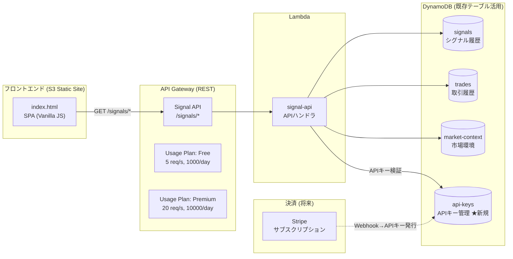

# シグナル公開API アーキテクチャ

AI売買シグナルをWebで公開し、マネタイズするための追加アーキテクチャ。

## 概要

既存の `signals` テーブルに蓄積されたAI判断データを、API Gateway経由でWebフロントエンドに公開する。
**無料ユーザーには30分遅延**、**有料ユーザーにはリアルタイム**でデータを提供。

## システム構成図



## エンドポイント一覧

| エンドポイント | 説明 | 無料 | 有料 |
|---|---|---|---|
| `GET /signals/latest` | 全通貨の最新シグナル | 30分遅延 | リアルタイム |
| `GET /signals/history?pair=eth_usdt&hours=24` | シグナル履歴 | 30分遅延 | リアルタイム |
| `GET /signals/ranking` | 通貨スコアランキング | 30分遅延 | リアルタイム |
| `GET /signals/performance?days=30` | 取引パフォーマンス統計 | ○ | ○ |
| `GET /signals/market` | マーケット環境 (F&G等) | ○ | ○ |
| `GET /signals/health` | ヘルスチェック | ○ | ○ |

## 無料 vs 有料の仕組み

### 遅延メカニズム
```
現在時刻: 14:30

有料ユーザー: signals WHERE timestamp <= 14:30 (リアルタイム)
無料ユーザー: signals WHERE timestamp <= 14:00 (30分前まで)
```

DynamoDBの `timestamp` Range Key を使い、Queryの `KeyConditionExpression` で
取得する時間範囲を制御するだけなので、**追加テーブルやデータコピーは不要**。

### APIキー認証
- リクエストヘッダー `X-Api-Key` で認証
- `api-keys` DynamoDBテーブルでキー管理
- TTL付きで有効期限を自動制御

## 料金プラン案

| プラン | 月額 | 内容 |
|---|---|---|
| Free | ¥0 | 30分遅延、基本統計、1000 API/日 |
| Pro | ¥2,980 | リアルタイム、詳細スコア、API、72h履歴、10000 API/日 |
| Enterprise | ¥9,800 | Pro + Webhook、カスタムアラート、優先サポート |

## 追加AWSコスト（推定）

| サービス | 月額コスト |
|---|---|
| API Gateway | ~$1-3 (100万リクエストまで$3.50) |
| Lambda (signal-api) | ~$0-1 (既存枠内) |
| DynamoDB (api-keys) | ~$0 (PAY_PER_REQUEST) |
| S3 (フロントエンド) | ~$0.02 |
| **合計** | **~$1-4/月** |

## 新規ファイル

```
services/
  signal-api/
    handler.py          ← APIハンドラ Lambda
frontend/
  index.html            ← 公開Webページ (S3にデプロイ)
terraform/
  api_gateway.tf        ← API Gateway + Lambda + S3定義
docs/
  signal-api.md         ← このドキュメント
```

## デプロイ手順

### 1. Terraform変数追加

`terraform.tfvars` に追加:
```hcl
signal_api_cors_origin = "*"   # 本番ではフロントエンドのドメインに制限
```

### 2. Terraform Apply

```bash
cd terraform
terraform plan
terraform apply
```

### 3. フロントエンドデプロイ

```bash
# API GatewayのURLを取得
API_URL=$(terraform output -raw signal_api_url)

# フロントエンドのAPIベースURLを設定
sed -i "s|/api|${API_URL}|g" ../frontend/index.html

# S3にアップロード
aws s3 sync ../frontend/ s3://$(terraform output -raw signal_frontend_bucket)/ \
  --content-type "text/html" --cache-control "max-age=300"
```

### 4. 有料ユーザーのAPIキー発行

```bash
# DynamoDBに直接追加（初期）
aws dynamodb put-item \
  --table-name eth-trading-api-keys \
  --item '{
    "api_key": {"S": "sk-xxxxxxxxxxxxxxxxxxxxxxxx"},
    "user_email": {"S": "user@example.com"},
    "plan": {"S": "pro"},
    "is_active": {"BOOL": true},
    "created_at": {"N": "1739260800"},
    "expires_at": {"N": "1741852800"}
  }'
```

## 将来の拡張

### Phase 1 (MVP) ← 今回の実装
- [x] Signal API Lambda
- [x] API Gateway (REST)
- [x] 静的フロントエンド (S3)
- [x] 30分遅延 / リアルタイム切り替え
- [x] 手動APIキー管理

### Phase 2 (決済連携)
- [ ] Stripe Checkout 連携
- [ ] Stripe Webhook → APIキー自動発行 Lambda
- [ ] ユーザーダッシュボード（プロフィール、プラン管理）

### Phase 3 (機能拡充)
- [ ] Discord / LINE 通知連携
- [ ] Webhook配信（Enterprise向け）
- [ ] スコア推移チャート (Chart.js)
- [ ] 過去の的中率・パフォーマンス詳細レポート
- [ ] CloudFront CDN配信

### Phase 4 (スケーリング)
- [ ] Cognito ユーザープール
- [ ] CloudFront + WAF
- [ ] カスタムドメイン (Route53)
- [ ] 多言語対応 (英語サイト)
