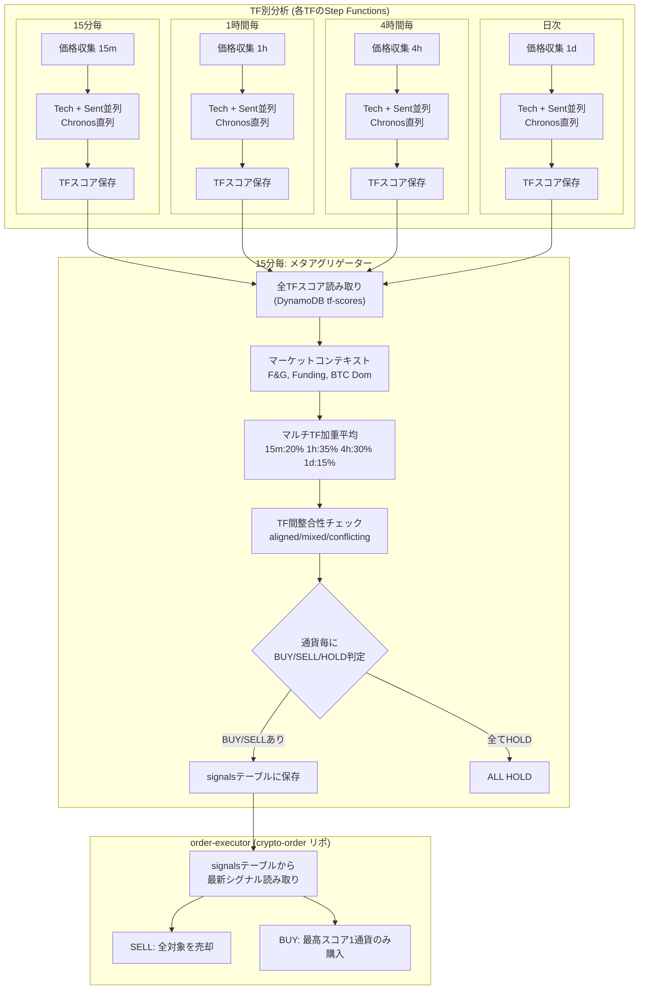

# 売買戦略設計書

マルチタイムフレーム・マルチ通貨戦略のスコアリング、売買判定の詳細。

---

## マルチタイムフレーム戦略の全体像



---

## マルチタイムフレーム設定

| TF | Binance間隔 | 実行頻度 | TTL | Chronos入力 | 予測先 | スコアスケール |
|---|---|---|---|---|---|---|
| 15m | 15m | 15分毎 | 14日 | 336本 (3.5日) | 3時間 | ±3% |
| 1h | 1h | 1時間毎 | 30日 | 336本 (14日) | 12時間 | ±5% |
| 4h | 4h | 4時間毎 | 90日 | 336本 (56日) | 48時間 | ±10% |
| 1d | 1d | 日次 | 365日 | 250本 (250日) | 12日 | ±20% |

### TF加重ウェイト

| TF | ウェイト | 役割 |
|---|---|---|
| 15m | 20% | エントリータイミング |
| 1h | **35%** | 中期トレンド方向（最重要） |
| 4h | 30% | 大局観 |
| 1d | 15% | 長期トレンド確認 |

### TF間整合性チェック

- **aligned** (75%以上同方向): スコア × 1.15 ボーナス
- **mixed** (50-75%): そのまま
- **conflicting** (50%以下): スコア × 0.85 ペナルティ

### TF別テクニカルパラメータ

各TFの足の特性に合わせて、スコアリングの正規化基準を調整:

| パラメータ | 15m | 1h | 4h | 1d | 概要 |
|---|---|---|---|---|---|
| RSI減衰(穏やか) | 4本(1h) | 3本(3h) | 2本(8h) | 2本(2d) | 50%減衰開始バー数 |
| RSI減衰(強い) | 12本(3h) | 6本(6h) | 4本(16h) | 3本(3d) | 25%減衰バー数 |
| MACD histスケール | ±0.10% | ±0.20% | ±0.50% | ±1.00% | 価格比で±1.0になる値 |
| SMA乖離スケール | ±1.5% | ±3.0% | ±5.0% | ±10.0% | フルスコアになる乖離率 |
| BB幅ベースライン | 3.0% | 4.5% | 7.0% | 12.0% | ボラ補正の基準値 |

**設計根拠**: 5分足でのハードコード値（RSI減衰 12/36bars, MACD ±0.1%, SMA ±2%, BB 3%）は
その足の典型的な変動幅に合わせたものだった。マルチTFでは同じロジックを
各足の典型的変動幅に合わせてスケーリング。

### TF別 BUY/SELL/HOLD判定

各TFにStep Functionsが分析完了時に、TF別のBUY/SELL/HOLDを算出:
- TF別BBベースラインでボラ補正（マーケットコンテキストなし、F&G補正なし）
- DynamoDB tf-scoresテーブルに signal フィールドとして保存
- メタアグリゲーターのSlack通知でTF別シグナルを表示

**最終判定はメタアグリゲーターが行う**:
- 全TFスコアの加重平均 + 整合性チェック + マーケットコンテキスト + F&G補正
- TF別シグナルは参考情報（人間が各足の状況を把握するため）

---

## スコアリング

### 4つの分析軸

| 分析 | 重み | スコア範囲 | データソース |
|---|---|---|---|
| テクニカル | **35%** | -1 〜 +1 | Binance TF別OHLCV |
| AI予測 (Chronos) | **35%** | -1 〜 +1 | Binance 価格履歴 (Typical Price) |
| センチメント | 15% | -1 〜 +1 | CryptoPanic ニュース |
| マーケットコンテキスト | **15%** | -1 〜 +1 | F&G, Binance Funding, CoinGecko |

```
total_score = technical × 0.35 + chronos × 0.35 + sentiment × 0.15 + market_context × 0.15
```

> **ウェイト根拠 (Phase 4)**: Phase 3 の 4成分体制 (Tech=0.45, Chronos=0.25) では
> テクニカルが支配的すぎた。AI(Chronos)の予測精度が向上し、実際の市場に
> 近い評価を出し始めたため、TechとAIを同等の基準重み(0.35/0.35)に変更。
> 確信度による動的シフトは±0.08に縮小（旧±0.10/0.15）。

### テクニカル分析の内訳

| 指標 | 重み | 意味 |
|---|---|---|
| RSI (14) | 15-35% | 4ゾーン制: <30/>70はフルウェイト、30-40/60-70は30%上限グラデーション、40-60はデッドバンド(≈0)。継続時間減衰 + トレンド方向抑制付き |
| MACD (12,26,9) | 15-35% | ヒストグラム振幅ベースのグラデーションスコア |
| SMA20 vs SMA200 | 15-35% | SMA20/SMA200乖離率グラデーション（TF別スケール: 15m=±1.5%, 1h=±3%, 4h=±5%, 1d=±10%） |
| Bollinger Bands (20,2) | 15-35% | 二乗カーブ（中央付近は穏やか、バンド端のみ急激なスコア） |
| ADX (14) | - | レジーム検知に使用 (>25:トレンド, <20:レンジ)。正式OHLC対応 |
| ATR (14) | - | ボラティリティ指標。正式True Range (H-L, |H-PrevC|, |L-PrevC|) |
| Volume | - | 出来高乗数 (1.0-1.3)。急増時にスコア増幅 |

> **レジーム適応型ウェイト**: ADXによる相場状態判定でウェイトが動的に変化
> - トレンド相場 (ADX>25): MACD/SMA = 0.35, RSI/BB = 0.15
> - レンジ相場 (ADX<20): RSI/BB = 0.35, MACD/SMA = 0.15
> - 中立: 均等 0.25

> **RSIスコアリング（4ゾーン制）**:
> - **<30 / >70**: フルウェイト (±w_rsi) ← 明確な売られすぎ/買われすぎ
> - **30-40 / 60-70**: 最大30%のグラデーション (±w_rsi×0.3) ← 接近中だが確定前
> - **40-60**: デッドバンド (≈0) ← 中立帯、スコアにほぼ影響しない
> - **継続時間減衰**: TF別バー数で「落ちるナイフ」検知（15m: 4bars/12bars, 1h: 3/6, 4h: 2/4, 1d: 2/3）
> - **トレンド方向抑制**: トレンド相場でMACDが下向きなのにRSIが「売られすぎ買い」→70%抑制（落ちるナイフ防止）
>
> **SMAスコアリング（乖離率グラデーション）**:
> - SMA20とSMA200の乖離率を計算し、TF別スケールでフルスコアとして線形スケール
> - 例: 1h足で乖離率 0.3%程度のデッドクロスでは w_sma×0.10 程度の軽微な影響に留まる
> - 旧方式のバイナリ(±w_sma固定)による過剰反応を解消
>
> **BBスコアリング（二乗カーブ）**:
> - バンド内の位置を0-1に正規化後、二乗カーブを適用
> - 中央付近 (BB=0.6): スコア影響は線形の20%に縮小
> - バンド端 (BB=0.9): スコア影響は線形の80%を維持
> - 旧方式の線形カーブによるBB中央付近での過剰反応を解消

### AI予測 (Chronos)

- **SageMaker Serverless Endpoint**: Chronos-2 (120Mパラメータ) を SageMaker Serverless Endpoint で推論。冷起動時に ~25-30秒のレイテンシが発生するが Lambda Timeout=180s で吸収
- **入力**: **Typical Price (H+L+C)/3** を使用。close のみよりローソク足の値動きの重心を反映。OHLCがない古いレコードは close にフォールバック
- **TF別スコアスケール**: タイムフレームに応じた変動スケールで予測を正規化
  - 15m: ±3% — 短期の小さな変動を捉える
  - 1h: ±5% — 中期トレンドの標準スケール
  - 4h: ±10% — 大きなトレンド変動
  - 1d: ±20% — 日足レベルの大局的変動
- **TF別入力長**: 15m/1h/4h=336本、1d=250本
- **Step Functions MaxConcurrency=1**: SageMaker同時リクエスト制限を遵守するため、Chronosフェーズは通貨を直列実行
- SageMaker推論失敗時の代替: **モメンタムベーススコア**
  - 短期モメンタム（5期間）× 60% + 中期モメンタム（10期間）× 40%
  - ±2%の変動で±1のスコア

### センチメント分析

**ニュースソース**: CryptoPanic Growth Plan API (v2)

```
全通貨ニュース取得 (1 API call)
  → instruments フィールドで通貨別にフィルタリング
  → 各記事に重み付け:
      直接関連ニュース: ×1.0
      BTC相関ニュース:  ×0.5 (BTC以外の通貨に適用)
      全体市場ニュース: ×0.3
  → 時間減衰: 新しいほど重み大 (1h以内=1.0, 24h=0.1)
  → スコア決定:
      投票数 ≥5: 賛否比率 × 信頼度係数
      投票数 <5:  AWS Bedrock (Nova Micro) によるLLMセンチメント分析:
        - 全投票不足記事のタイトルを1回のAPIコールでバッチ分析
        - 暠定語、文脈、暗号通貨ドメイン知識を考慮した高精度スコア
        - temperature=0.0 で決定的な出力を確保
        - Bedrock失敗時: ルールベースNLPに自動フォールバック
      + panic_score による微調整 (±0.10)
```

**API最適化**: 全通貨ニュースを1コールで取得 + 全体市場を1コール = **計2 API calls/30分**
→ 月間約2,880コール（Growth Plan上限 3,000の範囲内）

### マーケットコンテキスト分析 (Phase 3 新設)

3つのマクロ市場指標を30分間隔で収集し、市場全体の環境を評価。**全通貨共通のスコア**として適用。

| 指標 | API | 重み(内部) | 意味 | コスト |
|---|---|---|---|---|
| Fear & Greed Index | Alternative.me | 30% | 市場の恐怖/強欲度 (0-100)、±0.3キャップ+トレンド減衰 | 無料 |
| ファンディングレート | Binance Futures | 35% | レバレッジポジションの偏り | 無料 |
| BTC Dominance | CoinGecko Global | 35% | 資金フロー方向 | 無料 |

```
# Fear & Greed Index (逆張りロジック + キャップ + トレンド減衰)
0-10 (Extreme Fear):   スコア +0.30 (キャップ)    ← 恐怖は買い機会
11-25 (Fear):          スコア +0.10〜+0.30
26-45 (Mild Fear):     スコア  0.00〜+0.10
46-55 (Neutral):       スコア  0.00
56-75 (Greed):         スコア -0.10〜 0.00
76-90 (High Greed):    スコア -0.30〜-0.10
91-100 (Extreme Greed): スコア -0.30 (キャップ) ← 強欲は危険

※ キャップ: 逆張りスコアを±0.3に制限（下落トレンドでの早すぎる逆張りを防止）
※ トレンド減衰: 前回比でF&Gが3pt以上悪化方向 → 逆張りシグナルを50%に減衰
  例: F&G 15→11 (恐怖深化中): 買いシグナル50%減衰（落ちるナイフを掄まない）
  例: F&G 80→85 (強欲加速中): 売りシグナル50%減衰（FOMOに逆らわない）

# ファンディングレート (逆符号)
正のファンディング → ロング過多 → BUYに不利 (過熱)
負のファンディング → ショート過多 → BUY有利 (売られすぎ)
±0.05% で ±1.0 にクリップ

# BTC Dominance
> 50%: アルトに不利 (リスクオフ) → 負のスコア
< 50%: アルトに有利 (リスクオン) → 正のスコア
50%を中立として ±15% で ±1.0

# アルトコイン追加補正
BTC Dom > 60%: ETH/XRPに -0.05 ペナルティ
BTC Dom < 40%: ETH/XRPに +0.05 ボーナス
(BTC自身は補正なし)

market_context = fng_score × 0.30 + funding_score × 0.35 + dominance_score × 0.35
```

**設計上のポイント**:
- Market Context は Step Functions パイプラインに **含まれない**。Aggregator が DynamoDB から直接読み取る
- 30分間隔の EventBridge で独立収集。データが2時間以上古い場合は中立 (0.0) 扱い
- 全通貨で同一スコアを適用（マクロ環境は通貨間で共通）、ただしBTC Dominance補正はアルト通貨のみ

---

## 売買判定ロジック

### 通貨毎のBUY/SELL/HOLD判定（ポジション非依存）

**方針**: aggregator は全通貨を純粋にスコアと閾値で判定し、現在のポジション状況に影響されない。
判定結果は DynamoDB signals テーブルに保存され、[crypto-order](https://github.com/kiikun0530/crypto-order) の order-executor が最新シグナルを読み取って注文を執行する。
BUY対象が複数ある場合は最もスコアの高い1通貨のみ購入、SELLは全対象を売却する。

```
# 1. ボラティリティ適応型閾値を計算（通貨別ボラ補正 + F&G加算補正）
vol_ratio = 通貨別BB幅 / 基準BB幅(3%)  ← クランプ: 0.67〜2.0
fng_adder = +0.06 (Extreme Fear) / +0.04 (Extreme Greed) / 0 (その他)
buy_threshold  = min(BASE_BUY(0.25) × vol_ratio + fng_adder, 0.45)  ← 上限キャップ
sell_threshold = BASE_SELL(-0.13) × vol_ratio

# 2. 通貨毎にBUY/SELL/HOLD判定（ポジション非依存）
for each 通貨 in scored_pairs:
    if スコア >= buy_threshold → BUY
    elif スコア <= sell_threshold → SELL
    else → HOLD

# 3. DynamoDB signalsテーブルに保存済み（save_signal()で自動保存）

# 4. order-executorでの実行（crypto-orderリポ, EventBridge 15分毎起動）
SELL先（資金確保）:
    全対象のポジションがあれば売却、なければスキップ
BUY:
    最もスコアの高い1通貨のみ購入（集中投資）
```

**aggregator（判定）と order-executor（実行）の分離**:
- aggregator (crypto-trader): 純粋にスコア vs 閾値で判定。記録（DynamoDB signals）。
- order-executor (crypto-order): EventBridge 15分毎起動。signalsテーブルから読み取り、ポジション確認、残高確認、サーキットブレーカー、実際の注文API呼び出し。

**SELL処理（order-executor / crypto-order）**:
- 全SELL判定を処理
- 対象通貨のポジションがあれば売却、なければスキップ（「売る対象がなければ無視」）

**BUY処理（order-executor / crypto-order）**:
- BUY判定が複数あっても最もスコアの高い1通貨のみ購入（集中投資）
- ポジション既存ならスキップ → 残高確認 → Kelly/フォールバック比率で投資額算出 → 購入

**ポジションサイジングと複数保有**:
- 投資額は `available_jpy`（残りの日本円残高）から計算
- 複数ポジションを保有すると残高が減り、自然と1ポジションあたりの投資額が小さくなる
- MIN_ORDER_JPY(¥500) 未満になると新規BUYは実行されない

**ボラティリティ適応の意味**:
- **高ボラ時（BB幅 > 3%）**: 閾値を厳しく → ノイズに反応しない（例: BB幅6% → BUY閾値 +0.45 [CAP]）
- **低ボラ時（BB幅 < 3%）**: 閾値を緩く → 小さな確実なシグナルを拾う（例: BB幅2% → BUY閾値 +0.19）
- **平均時（BB幅 ≈ 3%）**: 基準閾値をそのまま使用（BUY +0.25 / SELL -0.13）
- **上限キャップ (0.45)**: どんなに高ボラ+Extreme環境でもBUY閾値は0.45を超えない

> **F&G補正方式変更根拠 (Phase 4.1)**: 旧方式（乗算: BASE×vol_ratio×fng_multiplier）では
> ボラ補正×F&G補正の二重効果で高ボラ通貨のBUY閾値が0.6超に達し、
> Tech+AIが共に強い買いシグナルでも絶対に届かない「永遠に買えない」状態が発生していた。
> 加算方式（BASE×vol_ratio + fng_adder） + 上限キャップ(0.45)で両補正を独立させ解消。

> **Phase 4 閾値調整根拠**: Tech/AI均等化(0.35/0.35)でTechの大きなスコア振幅の影響が縮小。
> スコア分布が約10%圧縮するため、BUY/SELL閾値を10-13%緩和してシグナル頻度を維持。
> 旧 BUY=0.28 / SELL=-0.15 → 新 BUY=0.25 / SELL=-0.13。

**ランキングの役割**:
- **BUY時**: 「未保有通貨の中でどれを買うか」を決める
- **SELL時**: 使わない（各保有通貨のスコアが動的sell_threshold以下かどうかのみ）
- **Slack通知**: 市場全体の温度感を人間が把握するための可視化

### スコア連動ポジションサイジング (Kelly Criterion)

BUYシグナル発生時、過去のトレード実績から最適な投資比率を算出:

**Kelly Criterion 公式**:
```
f* = (p × b - q) / b

p = 勝率（過去90日のクローズ済ポジションから算出）
q = 1 - p（敗率）
b = 平均勝ち% / 平均負け%（損益比）
f* = 最適投資比率
```

**安全マージン**:
- Half-Kelly 適用（f* × 0.5）: 破産確率を大幅に低減
- スコア変調: 低スコアはさらに保守的（×0.3〜1.0）
- クランプ: 最低10%、最大80%

| 勝率 | 損益比 | Full Kelly | Half-Kelly | スコア0.30時 |
|---|---|---|---|---|
| 60% | 2.0 | 40.0% | 20.0% | 10.0% |
| 50% | 2.0 | 25.0% | 12.5% | 10.0% |
| 40% | 2.0 | 10.0% | 5.0% | 10.0%† |
| 50% | 1.5 | 16.7% | 8.3% | 10.0%† |
| 40% | 1.5 | 6.7% | 3.3% | 10.0%† |

† 最低投資比率(10%)でクランプ

**フォールバック**（トレード履歴 5件未満時）:

| スコア | 投資比率 | 例（残高¥10,000） | 意味 |
|---|---|---|---|
| 0.45+ | 60% | ¥6,000 | 非常に強いシグナル |
| 0.35-0.45 | 45% | ¥4,500 | 強いシグナル |
| 0.25-0.35 | 30% | ¥3,000 | 中程度のシグナル |
| 0.15-0.25 | 20% | ¥2,000 | 弱いシグナル |
| 0.15未満 | 0% | - | 見送り |

**計算元**: Coincheck の日本円残高をリアルタイム取得し、Kelly比率を適用
**上限**: MAX_POSITION_JPY (デフォルト ¥15,000、環境変数で変更可) で絶対額をキャップ
**下限**: MIN_ORDER_JPY (¥500) 未満は注文しない
**予備**: RESERVE_JPY (¥1,000) を常に残高に確保

---

## リスク管理

### ストップロス / テイクプロフィット / トレーリングストップ

| 項目 | デフォルト値 | 説明 |
|---|---|---|
| Stop Loss | -5% | 参入価格から5%下落で損切り |
| Take Profit | +30% | 安全弁。利確はトレーリングストップに委任 |
| トレーリング 3%+ | 連続トレーリング | ピーク価格から動的SL（下記表参照） |

- position-monitor (crypto-order) が5分間隔で全通貨のアクティブポジションを監視
- SL/TP はポジション作成時に設定され、ポジションレコードに保存
- **連続トレーリングストップ**: ピーク価格をDynamoDBに永続化し、ピークからの下落率でSLを動的に設定
  - 含み益 3%未満: 固定SL (-5%)
  - 含み益 3-5%: ピークから2.0%下にSL（広め、成長余地あり）
  - 含み益 5-8%: ピークから1.5%下にSL（中間）
  - 含み益 8-12%: ピークから1.2%下にSL（狭め、利益防衛優先）
  - 含み益 12%+: ピークから1.0%下にSL（最狭、大利確保）
  - 最低でも建値+0.1%以上を保証（手数料分）
- Take Profit (+30%) は異常時の最終防衛線。通常はトレーリングストップが主な利確手段
- トリガー時は position-monitor (crypto-order) が直接 Coincheck API で売り指示（確実な実行を保証）

### サーキットブレーカー

order-executor (crypto-order) にBUY注文前の安全装置として実装（デフォルトOFF）:

| 条件 | 閾値 | 動作 |
|------|------|------|
| 日次累計損失 | ¥50,000 | BUY停止 |
| 連敗 | 5回 | BUY停止 |
| 冷却時間 | 6時間 | トリップ後の待機 |

環境変数 `CIRCUIT_BREAKER_ENABLED=true` で有効化。SELLは常に許可。

### 注文の確実性

```
aggregator → DynamoDB (signals) ← order-executor (crypto-order, EventBridge 15分毎)
                                       ↓ (失敗時)
                                 CloudWatch Alarm → Slack通知
```

---

## 分析サイクル

4つのタイムフレーム (15m, 1h, 4h, 1d) がそれぞれ独立した EventBridge スケジュールで Step Functions を起動する。各TFの Step Functions は4フェーズ構成:

1. **PriceCollection**: 対象TFの価格を収集
2. **AnalyzeTechSentiment**: 通貨毎にテクニカル+センチメント並列 (MaxConcurrency=3)
3. **ChronosSequential**: 通貨毎にChronos推論直列 (MaxConcurrency=1)
4. **SaveTFScores**: aggregator (tf_score モード) でTFスコアをDynamoDBに保存

加えて、15分間隔の **メタアグリゲーター** が全TFスコアを読み取り、加重平均+整合性チェックで最終スコアを算出し、売買判定を行う。

**設計根拠**: TFごとに独立実行することで、1hや4hの分析が15m分析をブロックしない。メタアグリゲーターは最新のTFスコアを常に使い、古いスコアは陳腐化判定 (staleness) で除外する。

---

## Slack通知のフォーマット

メタアグリゲーター完了ごとにSlackに以下が通知される:

```
📊 マルチTF通貨分析: BUY 1件 / SELL 0件 / HOLD 2件

🌍 市場環境
F&G: 14 (Extreme Fear) | BTC Dom: 56.9% | Scores: F&G=+0.397 Fund=+0.133 Dom=-0.457

📊 通貨ランキング（期待値順）
🥇 Ethereum:  +0.4234  ▓▓▓▓▓▓▓▓░░ → 🟢BUY
    15m: +0.32🟢 | 1h: +0.48🟢 | 4h: +0.52🟢 | 1d: +0.38⚪ | 🟢aligned
    Mkt: +0.147 | 閾値: BUY≥+0.220 / SELL≤-0.115
🥈 Bitcoin:   +0.2521  ▓▓▓▓▓▓▓░░░ → ⚪PHOLD
    15m: +0.15⚪ | 1h: +0.31⚪ | 4h: +0.28⚪ | 1d: +0.22⚪ | 🟡mixed
    Mkt: +0.147 | 閾値: BUY≥+0.185 / SELL≤-0.097
🥉 XRP:       +0.0800  ▓▓▓▓▓▓░░░░ → ⚪HOLD
    15m: -0.10🔴 | 1h: +0.15⚪ | 4h: +0.12⚪ | 1d: +0.05⚪ | 🔴conflicting
    Mkt: +0.147 | 閾値: BUY≥+0.310 / SELL≤-0.163

💼 ポジション (1件)
📈 Ethereum (eth_jpy) 参入: ¥320,000 → 現在: ¥333,057 | P/L: +¥13,057 (+4.08%) | 保有45分
💰 合計含み損益: +¥13,057

基準閾値: BUY≥+0.250 / SELL≤-0.130 (通貨別ボラ補正あり) | TFウェイト: 15m=20% 1h=35% 4h=30% 1d=15%
```

全てHOLDの場合:
```
⚪ マルチTF通貨分析: ALL HOLD
```

---

## 将来の拡張性

### 通貨の追加・削除

`TRADING_PAIRS_CONFIG` 環境変数を変更するだけで対応。Terraform の `trading_pairs_config` 変数を修正して `terraform apply` すれば完了。

```json
{
  "eth_usdt": {"binance": "ETHUSDT", "coincheck": "eth_jpy", "news": "ETH", "name": "Ethereum"},
  "xrp_usdt": {"binance": "XRPUSDT", "coincheck": "xrp_jpy", "news": "XRP", "name": "XRP"}
}
```

### マルチポジション化

✅ **実装済み**: 複数通貨の同時保有に対応。aggregator は通貨毎にポジション非依存でBUY/SELL/HOLD判定し、DynamoDB signalsテーブルに保存。order-executor (crypto-order) が EventBridge 15分毎起動でシグナルを読み取り、ポジション・残高を確認して実際の注文を実行。BUYは最高スコアの1通貨のみ、SELLは全対象。投資額は `available_jpy`（残りJPY残高）から自然に分配される。

### より大きなモデルへの移行

✅ **Phase 4 完了**: Chronos-2 (120Mパラメータ) を SageMaker Serverless Endpoint で実行中。
旧 Chronos-T5-Tiny (8M) + ONNX on Lambda からの移行は完了。
さらなる精度向上が必要な場合:
- **SageMaker Provisioned**: MaxConcurrency を増やして安定したスループットを確保
- **ECS Fargate**: より大きなモデル（Chronos-Large等）をコンテナで実行
- フォールバック（モメンタムベーススコア）は維持

---

## スコア特性と設計上の注意点

### センチメントスコアの特性

センチメントスコアは通常 **0.55〜0.65**（0-1スケール）の範囲に収まる。これはCryptoPanic上の投票データが一般的にやや強気寄りであることを反映しており、正常な動作である。

- 正規化後（-1〜+1スケール）: 約 **+0.10〜+0.30** 程度
- 重み15%のため最終スコアへの寄与: 約 **+0.015〜+0.045**
- 強いシグナル（>0.8や<0.2）が出るのは、大幅なハック、ETF承認等の重大ニュース時のみ

### AI予測スコアのスケーリング

Chronos-2 は価格の「方向」を予測する点で優秀。TF別のスケーリングで各時間軸の変動幅に適応:

| TF | スケール | 榹拠 |
|---|---|---|
| 15m | ±3% | 短期では小幅変動が典型 |
| 1h | ±5% | 中期トレンドの標準的なスケール |
| 4h | ±10% | マクロトレンドの変動幅 |
| 1d | ±20% | 日足レベルでは大きな変動が範囲内 |

### 売りシグナルの発生条件

売りシグナルには `total_score <= sell_threshold` が必要。メタアグリゲーターが全TFの加重平均スコアにマーケットコンテキストを加味した最終スコアで判定する。閾値は通貨ごとのBB幅（ボラティリティ）に基づいて個別計算される（基準: -0.13）。

| 15m | 1h | 4h | 1d | 整合性 | Mkt | 最終スコア | 判定 |
|---|---|---|---|---|---|---|---|
| -0.4 | -0.5 | -0.6 | -0.3 | aligned(×1.15) | +0.10 | -0.456 | ✅ SELL |
| -0.2 | -0.3 | -0.4 | +0.1 | mixed | -0.10 | -0.255 | ✅ SELL |
| +0.1 | -0.2 | -0.1 | +0.2 | conflicting(×0.85) | +0.05 | -0.001 | ❌ HOLD |
| -0.3 | -0.5 | -0.4 | -0.6 | aligned(×1.15) | -0.20 | -0.643 | ✅ SELL |

マルチTF体制ではTF間の整合性が重要。全TFが揃って下向きなら alignment bonus で SELL が発動しやすくなり、TF間で方向がバラバラなら penalty で慎重判定となる。
