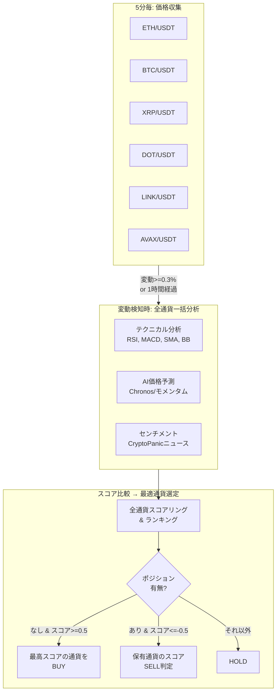

# 売買戦略設計書

マルチ通貨選定ロジック、スコアリング、売買判定の詳細。

---

## マルチ通貨戦略の全体像



---

## スコアリング

### 3つの分析軸

| 分析 | 重み | スコア範囲 | データソース |
|---|---|---|---|
| テクニカル | 45% | -1 〜 +1 | Binance 5分足OHLC |
| AI予測 (Chronos) | 40% | -1 〜 +1 | Binance 価格履歴 |
| センチメント | 15% | -1 〜 +1 | CryptoPanic ニュース |

```
total_score = technical × 0.45 + chronos × 0.40 + sentiment × 0.15
```

### テクニカル分析の内訳

| 指標 | 重み | 意味 |
|---|---|---|
| RSI (14) | 25% | 買われすぎ(>70)/売られすぎ(<30) |
| MACD (12,26,9) | 25% | トレンド転換シグナル |
| SMA20 vs SMA200 | 25% | ゴールデン/デッドクロス |
| Bollinger Bands (20,2) | 25% | ボラティリティと位置 |

### AI予測 (Chronos)

- ECS上のChronos API が設定されている場合: 時系列予測で±3%以上の変動予測を最大スコアに変換
- ECS未デプロイ時の代替: **モメンタムベーススコア**
  - 短期モメンタム（5期間）× 60% + 中期モメンタム（10期間）× 40%
  - ±2%の変動で±1のスコア

### センチメント分析

**ニュースソース**: CryptoPanic Growth Plan API

```
全通貨ニュース取得 (1 API call)
  → 通貨別にフィルタリング
  → 各記事に重み付け:
      直接関連ニュース: ×1.0
      BTC相関ニュース:  ×0.5 (BTC以外の通貨に適用)
      全体市場ニュース: ×0.3
  → 時間減衰: 新しいほど重み大 (1h以内=1.0, 24h=0.1)
  → 投票信頼性: 5票未満は中立、5-20票で信頼度線形増加
```

**API最適化**: 全通貨ニュースを1コールで取得 + 全体市場を1コール = **計2 API calls/30分**
→ 月間約2,880コール（Growth Plan上限 3,000の範囲内）

---

## 売買判定ロジック

### 1ポジション排他制御

**制約**: 全通貨を通じて **同時に1つのポジションしか保有しない**

```
if ポジションなし:
    全通貨をスコア降順でランキング
    最高スコア >= BUY閾値(0.5) → その通貨を買い
    
elif ポジションあり:
    保有通貨のスコア <= SELL閾値(-0.5) → 売り
    
else:
    HOLD
```

**排他制御の理由**:

1. **資金効率**: ¥15,000上限で複数通貨に分散すると、1ポジションが¥2,500程度になり、MIN_ORDER_JPY(¥500)とのマージンが小さすぎる
2. **期待値集中**: 最も期待値の高い1通貨に集中投資する方が、小資金では合理的
3. **リスク管理**: 暗号通貨は相関が高く（BTC↓ → 全面安）、分散しても同時に損失を被る可能性が高い

### ポジションスイッチはしない

保有中のBTCのスコアが0.1で、ETHのスコアが0.8でも、BTCを売ってETHに乗り換える**ことはしない**。

理由:
- 頻繁なスイッチはスプレッドコストが嵩む
- 「売った直後に上がる」を避ける
- SELL閾値(-0.5)以下で初めて売却 → 明確なシグナルで行動

### スコア連動ポジションサイジング

BUYシグナル発生時、スコアの強さに応じて投資金額を調整:

| スコア | 投資比率 | 例（残高¥10,000） | 意味 |
|---|---|---|---|
| 0.90+ | 100% | ¥10,000 | 非常に強いシグナル |
| 0.80-0.90 | 75% | ¥7,500 | 強いシグナル |
| 0.70-0.80 | 50% | ¥5,000 | 中程度のシグナル |
| 0.65-0.70 | 30% | ¥3,000 | 弱いシグナル |
| 0.65未満 | 0% | - | 見送り |

**上限**: MAX_POSITION_JPY (デフォルト ¥15,000) で絶対額を制限
**下限**: MIN_ORDER_JPY (¥500) 未満は注文しない
**予備**: RESERVE_JPY (¥1,000) を常に残高に確保

---

## リスク管理

### ストップロス / テイクプロフィット

| 項目 | デフォルト値 | 説明 |
|---|---|---|
| Stop Loss | -5% | 参入価格から5%下落で損切り |
| Take Profit | +10% | 参入価格から10%上昇で利確 |

- position-monitor が5分間隔で全通貨のアクティブポジションを監視
- SL/TP はポジション作成時に設定され、ポジションレコードに保存
- トリガー時は SQS 経由で order-executor に売り指示（確実な実行を保証）

### 注文の確実性

```
aggregator → SQS → order-executor
                      ↓ (失敗時)
              自動リトライ (最大3回)
                      ↓ (3回失敗)
              DLQ → CloudWatch Alarm → Slack通知
```

---

## 分析トリガー条件

価格収集は5分間隔で全通貨を実行するが、分析（Step Functions）は常に実行されるわけではない:

| トリガー | 条件 | 理由 |
|---|---|---|
| 変動トリガー | いずれかの通貨で1時間変動率 >= 0.3% | 急変時は即座に判断 |
| 定期トリガー | いずれかの通貨で前回分析から1時間経過 | 安定時も定期チェック |

**重要**: いずれかの通貨がトリガーされた場合、**全通貨を一括分析**する。これにより、常に6通貨のスコアランキングが最新の状態で比較される。

---

## Slack通知のフォーマット

分析完了ごとにSlackに以下が通知される:

```
🟢 マルチ通貨分析: BUY

判定: BUY          対象: eth_jpy

📊 通貨ランキング（期待値順）
🥇 Ethereum:  +0.7234  ▓▓▓▓▓▓▓▓░░
    Tech: +0.812 | AI: +0.654 | Sent: +0.321
🥈 Bitcoin:   +0.4521  ▓▓▓▓▓▓▓░░░
    Tech: +0.534 | AI: +0.412 | Sent: +0.123
🥉 XRP:       +0.2100  ▓▓▓▓▓▓░░░░
    Tech: +0.312 | AI: +0.123 | Sent: -0.045
...

📍 ポジション: なし | BUY閾値: 0.5 / SELL閾値: -0.5

⚡ BUY注文をキューに送信しました (eth_jpy)
```

---

## 将来の拡張性

### 通貨の追加・削除

`TRADING_PAIRS_CONFIG` 環境変数を変更するだけで対応。Terraform の `trading_pairs_config` 変数を修正して `terraform apply` すれば完了。

```json
{
  "eth_usdt": {"binance": "ETHUSDT", "coincheck": "eth_jpy", "news": "ETH", "name": "Ethereum"},
  "sol_usdt": {"binance": "SOLUSDT", "coincheck": "sol_jpy", "news": "SOL", "name": "Solana"}
}
```

### マルチポジション化

現在は1ポジション制約だが、資金が増えた場合は以下が可能:
- `MAX_CONCURRENT_POSITIONS` 環境変数で同時保有数を制御
- 通貨間の相関を考慮した分散投資ロジック

### ECS追加時

Amazon Chronos を本格的に実行する場合:
- ECS Fargate ($15/月) + ALB ($5/月) + NAT Gateway ($45/月) = +$65/月
- `CHRONOS_API_URL` 環境変数を設定するだけで切り替え可能
