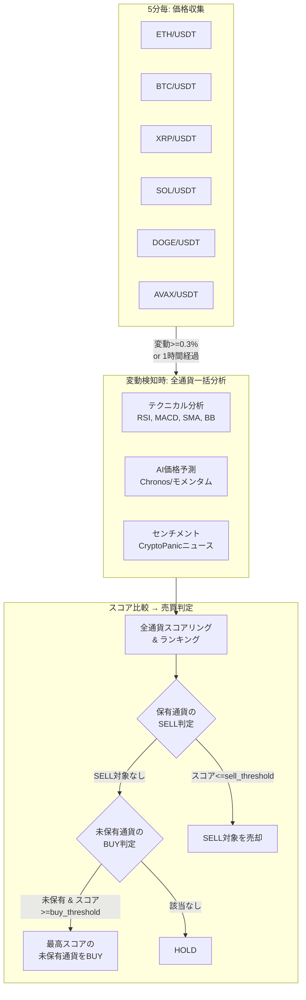

# 売買戦略設計書

マルチ通貨選定ロジック、スコアリング、売買判定の詳細。

---

## マルチ通貨戦略の全体像



---

## スコアリング

### 3つの分析軸

| 分析 | 重み | スコア範囲 | データソース |
|---|---|---|---|
| テクニカル | **55%** | -1 〜 +1 | Binance 5分足OHLCV |
| AI予測 (Chronos) | **30%** | -1 〜 +1 | Binance 価格履歴 (Typical Price) |
| センチメント | 15% | -1 〜 +1 | CryptoPanic ニュース |

```
total_score = technical × 0.55 + chronos × 0.30 + sentiment × 0.15
```

> **ウェイト根拠**: 810シグナルの相関分析で分散比 Tech=0.57, Chronos=0.35, Sent=0.08。
> Chronos の near-zero 率が 51.9% と高く、テクニカル重視がデータドリブンで正当化。

### テクニカル分析の内訳

| 指標 | 重み | 意味 |
|---|---|---|
| RSI (14) | 15-35% | 買われすぎ(>70)/売られすぎ(<30)。Wilder's 指数平滑化 |
| MACD (12,26,9) | 15-35% | ヒストグラム振幅ベースのグラデーションスコア |
| SMA20 vs SMA200 | 15-35% | ゴールデン/デッドクロス |
| Bollinger Bands (20,2) | 15-35% | 線形グラデーション + バンド外ボーナス |
| ADX (14) | - | レジーム検知に使用 (>25:トレンド, <20:レンジ)。正式OHLC対応 |
| ATR (14) | - | ボラティリティ指標。正式True Range (H-L, |H-PrevC|, |L-PrevC|) |
| Volume | - | 出来高乗数 (1.0-1.3)。急増時にスコア増幅 |

> **レジーム適応型ウェイト**: ADXによる相場状態判定でウェイトが動的に変化
> - トレンド相場 (ADX>25): MACD/SMA = 0.35, RSI/BB = 0.15
> - レンジ相場 (ADX<20): RSI/BB = 0.35, MACD/SMA = 0.15
> - 中立: 均等 0.25

### AI予測 (Chronos)

- **ONNX Runtime on Lambda**: Chronos-T5-Tiny を ONNX 変換し Lambda 上で直接推論。S3 からモデルをダウンロード＆ /tmp キャッシュ
- **KVキャッシュデコード**: `decoder_with_past_model.onnx` を使った高速自己回帰デコード。初回ステップで KV 抽出、2ステップ目以降は最後の1トークンのみ入力 (O(n) vs O(n²))
- **入力**: **Typical Price (H+L+C)/3** を使用。close のみよりローソク足の値動きの重心を反映。OHLCがない古いレコードは close にフォールバック
- 時系列予測で±1%以上の変動予測を最大スコアに変換（12ステップ先、加重平均）
  - 1時間で±1%の変動は現実的なスケール、Chronosの40%ウェイトが実質的に機能
  - 旧±5%スケールではChronosスコアが常にほぼ0で無機能だった
- ONNX推論失敗時の代替: **モメンタムベーススコア**
  - 短期モメンタム（5期間）× 60% + 中期モメンタム（10期間）× 40%
  - ±2%の変動で±1のスコア

### センチメント分析

**ニュースソース**: CryptoPanic Growth Plan API (v2)

```
全通貨ニュース取得 (1 API call)
  → instruments フィールドで通貨別にフィルタリング
  → 各記事に重み付け:
      直接関連ニュース: ×1.0
      BTC相関ニュース:  ×0.5 (BTC以外の通貨に適用)
      全体市場ニュース: ×0.3
  → 時間減衰: 新しいほど重み大 (1h以内=1.0, 24h=0.1)
  → スコア決定:
      投票数 ≥5: 賛否比率 × 信頼度係数
      投票数 <5:  高度ルールベースNLPによるタイトル分析:
        - 3段階強度 (strong/moderate/mild)
        - 否定語検出 (直前3語以内の not/no/never 等で極性反転)
        - バイグラム/フレーズマッチング (20+フレーズ)
        - 暗号通貨ドメイン特化語彙
      + panic_score による微調整 (±0.10)
```

**API最適化**: 全通貨ニュースを1コールで取得 + 全体市場を1コール = **計2 API calls/30分**
→ 月間約2,880コール（Growth Plan上限 3,000の範囲内）

---

## 売買判定ロジック

### 複数ポジション同時保有（SELL優先ロジック）

**方針**: 全通貨を通じて **複数のポジションを同時に保有可能**。SELL判定を優先し、その後に未保有通貨のBUY判定を行う。

```
# 1. ボラティリティ適応型閾値を計算
全通貨のBB幅（ボリンジャーバンド幅）の平均を算出
vol_ratio = 平均BB幅 / 基準BB幅(3%)  ← クランプ: 0.5〜2.0
buy_threshold  = BASE_BUY(0.30) × vol_ratio
sell_threshold = BASE_SELL(-0.20) × vol_ratio

# 2. SELL判定（優先）
全保有ポジションを確認
保有通貨のスコア <= sell_threshold → 売り  ← 複数保有中でも各通貨を個別判定
※ BUYから30分以内のシグナルSELLは無視（SL/TPは有効）

# 3. BUY判定（未保有通貨のみ）
全通貨をスコア降順でランキング
未保有通貨の中で最高スコア >= buy_threshold → その通貨を買い
※ 同一通貨はMAX_POSITIONS_PER_PAIR(1)まで（通貨分散ルール）
※ サーキットブレーカートリップ中はBUYブロック
```

**SELL優先の理由**:
- 保有ポジションの損失拡大を防ぐことが最優先
- SELL判定後にBUYを行うため、売却で確保した資金を次のBUYに活用可能

**ポジションサイジングと複数保有**:
- 投資額は `available_jpy`（残りの日本円残高）から計算
- 複数ポジションを保有すると残高が減り、自然と1ポジションあたりの投資額が小さくなる
- MIN_ORDER_JPY(¥500) 未満になると新規BUYは実行されない

**ボラティリティ適応の意味**:
- **高ボラ時（BB幅 > 3%）**: 閾値を厳しく → ノイズに反応しない（例: BB幅6% → BUY閾値 +0.40）
- **低ボラ時（BB幅 < 3%）**: 閾値を緩く → 小さな確実なシグナルを拾う（例: BB幅1.5% → BUY閾値 +0.10）
- **平均時（BB幅 ≈ 3%）**: 基準閾値をそのまま使用（BUY +0.20 / SELL -0.20）

**ランキングの役割**:
- **BUY時**: 「未保有通貨の中でどれを買うか」を決める
- **SELL時**: 使わない（各保有通貨のスコアが動的sell_threshold以下かどうかのみ）
- **Slack通知**: 市場全体の温度感を人間が把握するための可視化

### スコア連動ポジションサイジング

BUYシグナル発生時、スコアの強さに応じて投資金額を調整:

| スコア | 投資比率 | 例（残高¥10,000） | 意味 |
|---|---|---|---|
| 0.45+ | 100% | ¥10,000 | 非常に強いシグナル |
| 0.35-0.45 | 75% | ¥7,500 | 強いシグナル |
| 0.25-0.35 | 50% | ¥5,000 | 中程度のシグナル |
| 0.15-0.25 | 30% | ¥3,000 | 弱いシグナル |
| 0.15未満 | 0% | - | 見送り |

**計算元**: Coincheck の日本円残高をリアルタイム取得し、スコアに応じた比率を適用
**上限**: MAX_POSITION_JPY (デフォルト ¥15,000、環境変数で変更可) で絶対額をキャップ
**下限**: MIN_ORDER_JPY (¥500) 未満は注文しない
**予備**: RESERVE_JPY (¥1,000) を常に残高に確保

---

## リスク管理

### ストップロス / テイクプロフィット / トレーリングストップ

| 項目 | デフォルト値 | 説明 |
|---|---|---|
| Stop Loss | -5% | 参入価格から5%下落で損切り |
| Take Profit | +10% | 参入価格から10%上昇で利確 |
| トレーリング+3% | SL→建値 | 含み益+3%で損失ゼロ保証 |
| トレーリング+5% | SL→+3% | 含み益+5%で利益確保 |
| トレーリング+8% | SL→+6% | 含み益+8%でさらに利益確保 |

- position-monitor が5分間隔で全通貨のアクティブポジションを監視
- SL/TP はポジション作成時に設定され、ポジションレコードに保存
- トレーリングストップは含み益に応じてSLを引き上げ、DynamoDBに永続化
- トリガー時は SQS 経由で order-executor に売り指示（確実な実行を保証）

### サーキットブレーカー

order-executorにBUY注文前の安全装置として実装（デフォルトOFF）:

| 条件 | 閾値 | 動作 |
|------|------|------|
| 日次累計損失 | ¥50,000 | BUY停止 |
| 連敗 | 5回 | BUY停止 |
| 冷却時間 | 6時間 | トリップ後の待機 |

環境変数 `CIRCUIT_BREAKER_ENABLED=true` で有効化。SELLは常に許可。

### 注文の確実性

```
aggregator → SQS → order-executor
                      ↓ (失敗時)
              自動リトライ (最大3回)
                      ↓ (3回失敗)
              DLQ → CloudWatch Alarm → Slack通知
```

---

## 分析トリガー条件

価格収集は5分間隔で全通貨を実行するが、分析（Step Functions）は常に実行されるわけではない:

| トリガー | 条件 | 理由 |
|---|---|---|
| 変動トリガー | いずれかの通貨で1時間変動率 >= 0.3% | 急変時は即座に判断 |
| 定期トリガー | いずれかの通貨で前回分析から1時間経過 | 安定時も定期チェック |

**重要**: いずれかの通貨がトリガーされた場合、**全通貨を一括分析**する。これにより、常に6通貨のスコアランキングが最新の状態で比較される。

---

## Slack通知のフォーマット

分析完了ごとにSlackに以下が通知される:

```
🟢 マルチ通貨分析: BUY

判定: BUY          対象: eth_jpy

📊 通貨ランキング（期待値順）
🥇 Ethereum:  +0.7234  ▓▓▓▓▓▓▓▓░░
    Tech: +0.812 | AI: +0.654 | Sent: +0.321
🥈 Bitcoin:   +0.4521  ▓▓▓▓▓▓▓░░░
    Tech: +0.534 | AI: +0.412 | Sent: +0.123
🥉 XRP:       +0.2100  ▓▓▓▓▓▓░░░░
    Tech: +0.312 | AI: +0.123 | Sent: -0.045
...

📍 保有ポジション:
  ETH: ¥320,000 → ¥333,057 (+¥13,057 / +4.08%)
  BTC: ¥14,500,000 → ¥14,800,000 (+¥300,000 / +2.07%)
  💰 未実現損益合計: +¥313,057

BUY閾値: +0.200 / SELL閾値: -0.200

⚡ BUY注文をキューに送信しました (xrp_jpy)
```

---

## 将来の拡張性

### 通貨の追加・削除

`TRADING_PAIRS_CONFIG` 環境変数を変更するだけで対応。Terraform の `trading_pairs_config` 変数を修正して `terraform apply` すれば完了。

```json
{
  "eth_usdt": {"binance": "ETHUSDT", "coincheck": "eth_jpy", "news": "ETH", "name": "Ethereum"},
  "sol_usdt": {"binance": "SOLUSDT", "coincheck": "sol_jpy", "news": "SOL", "name": "Solana"}
}
```

### マルチポジション化

✅ **実装済み**: 複数通貨の同時保有に対応。SELL優先ロジックで保有ポジションの損切りを優先し、その後に未保有通貨のBUY判定を行う。投資額は `available_jpy`（残りJPY残高）から自然に分配される。

### より大きなモデルへの移行

現在は Chronos-T5-Tiny (8Mパラメータ) を Lambda + ONNX Runtime で実行しているが、将来的に精度向上が必要な場合:
- **SageMaker Serverless**: Chronos-Small/Base を SageMaker エンドポイントで実行（要クォータ申請）
- **ECS Fargate**: Chronos-Small コンテナ ($15/月) + ALB ($5/月) = +$20/月
- いずれの場合もフォールバック（モメンタムベーススコア）は維持

---

## スコア特性と設計上の注意点

### センチメントスコアの特性

センチメントスコアは通常 **0.55〜0.65**（0-1スケール）の範囲に収まる。これはCryptoPanic上の投票データが一般的にやや強気寄りであることを反映しており、正常な動作である。

- 正規化後（-1〜+1スケール）: 約 **+0.10〜+0.30** 程度
- 重み15%のため最終スコアへの寄与: 約 **+0.015〜+0.045**
- 強いシグナル（>0.8や<0.2）が出るのは、大幅なハック、ETF承認等の重大ニュース時のみ

### AI予測スコアのスケーリング

Chronos-T5-Tiny は価格の「方向」を予測する点で優秀。±1%のスケーリングでChronosの30%ウェイトが実質的に機能:

| スケール | 効果 | 備考 |
|---|---|---|
| ±5% (旧) | スコアが常にほぼ0 | 1hで5%変動は稀、実質無機能 |
| **±1% (現行)** | **適度なスコア分散** | **1hで±1%は現実的** |
| ±0.5% | 頻繁にクリップ | 過度に敏感 |

### 売りシグナルの発生条件

売りシグナルには `total_score <= sell_threshold (基準: -0.20)` が必要。典型的なシナリオ:

| テクニカル | AI予測 | センチメント | 合計スコア | 判定 |
|---|---|---|---|---|
| -0.6 | -0.5 | +0.18 | -0.453 | ✅ SELL |
| -0.3 | -0.4 | +0.15 | -0.263 | ✅ SELL |
| -0.2 | -0.2 | +0.18 | -0.143 | ❌ HOLD |
| +0.1 | -0.8 | +0.10 | -0.170 | ❌ HOLD |

テクニカルとAI予測の**両方**がネガティブになることが売りの基本条件。テクニカル重視（55%）のため、テクニカルが強い売りシグナルを出すことが特に重要。
