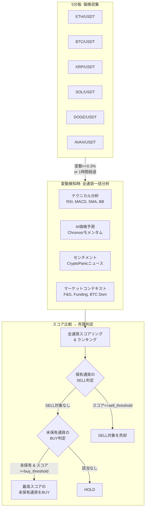

# 売買戦略設計書

マルチ通貨選定ロジック、スコアリング、売買判定の詳細。

---

## マルチ通貨戦略の全体像



---

## スコアリング

### 4つの分析軸

| 分析 | 重み | スコア範囲 | データソース |
|---|---|---|---|
| テクニカル | **35%** | -1 〜 +1 | Binance 5分足OHLCV |
| AI予測 (Chronos) | **35%** | -1 〜 +1 | Binance 価格履歴 (Typical Price) |
| センチメント | 15% | -1 〜 +1 | CryptoPanic ニュース |
| マーケットコンテキスト | **15%** | -1 〜 +1 | F&G, Binance Funding, CoinGecko |

```
total_score = technical × 0.35 + chronos × 0.35 + sentiment × 0.15 + market_context × 0.15
```

> **ウェイト根拠 (Phase 4)**: Phase 3 の 4成分体制 (Tech=0.45, Chronos=0.25) では
> テクニカルが支配的すぎた。AI(Chronos)の予測精度が向上し、実際の市場に
> 近い評価を出し始めたため、TechとAIを同等の基準重み(0.35/0.35)に変更。
> 確信度による動的シフトは±0.08に縮小（旧±0.10/0.15）。

### テクニカル分析の内訳

| 指標 | 重み | 意味 |
|---|---|---|
| RSI (14) | 15-35% | 買われすぎ(>70)/売られすぎ(<30)。Wilder's 指数平滑化 |
| MACD (12,26,9) | 15-35% | ヒストグラム振幅ベースのグラデーションスコア |
| SMA20 vs SMA200 | 15-35% | ゴールデン/デッドクロス |
| Bollinger Bands (20,2) | 15-35% | 線形グラデーション + バンド外ボーナス |
| ADX (14) | - | レジーム検知に使用 (>25:トレンド, <20:レンジ)。正式OHLC対応 |
| ATR (14) | - | ボラティリティ指標。正式True Range (H-L, |H-PrevC|, |L-PrevC|) |
| Volume | - | 出来高乗数 (1.0-1.3)。急増時にスコア増幅 |

> **レジーム適応型ウェイト**: ADXによる相場状態判定でウェイトが動的に変化
> - トレンド相場 (ADX>25): MACD/SMA = 0.35, RSI/BB = 0.15
> - レンジ相場 (ADX<20): RSI/BB = 0.35, MACD/SMA = 0.15
> - 中立: 均等 0.25

### AI予測 (Chronos)

- **SageMaker Serverless Endpoint**: Chronos-2 (120Mパラメータ) を SageMaker Serverless Endpoint で推論。冷起動時に ~25-30秒のレイテンシが発生するが Lambda Timeout=180s で吸収
- **入力**: **Typical Price (H+L+C)/3** を使用。close のみよりローソク足の値動きの重心を反映。OHLCがない古いレコードは close にフォールバック
- 時系列予測で±3%以上の変動予測を最大スコアに変換（12ステップ先、加重平均）
  - `SCORE_SCALE_PERCENT = 3.0` — ±3% の変動で ±1.0 のスコア
  - 旧±1%スケールでは Chronos スコアが過度に敏感だったため拡大
- SageMaker推論失敗時の代替: **モメンタムベーススコア**
  - 短期モメンタム（5期間）× 60% + 中期モメンタム（10期間）× 40%
  - ±2%の変動で±1のスコア

### センチメント分析

**ニュースソース**: CryptoPanic Growth Plan API (v2)

```
全通貨ニュース取得 (1 API call)
  → instruments フィールドで通貨別にフィルタリング
  → 各記事に重み付け:
      直接関連ニュース: ×1.0
      BTC相関ニュース:  ×0.5 (BTC以外の通貨に適用)
      全体市場ニュース: ×0.3
  → 時間減衰: 新しいほど重み大 (1h以内=1.0, 24h=0.1)
  → スコア決定:
      投票数 ≥5: 賛否比率 × 信頼度係数
      投票数 <5:  AWS Bedrock (Claude 3.5 Haiku) によるLLMセンチメント分析:
        - 全投票不足記事のタイトルを1回のAPIコールでバッチ分析
        - 暠定語、文脈、暗号通貨ドメイン知識を考慮した高精度スコア
        - temperature=0.0 で決定的な出力を確保
        - Bedrock失敗時: ルールベースNLPに自動フォールバック
      + panic_score による微調整 (±0.10)
```

**API最適化**: 全通貨ニュースを1コールで取得 + 全体市場を1コール = **計2 API calls/30分**
→ 月間約2,880コール（Growth Plan上限 3,000の範囲内）

### マーケットコンテキスト分析 (Phase 3 新設)

3つのマクロ市場指標を30分間隔で収集し、市場全体の環境を評価。**全通貨共通のスコア**として適用。

| 指標 | API | 重み(内部) | 意味 | コスト |
|---|---|---|---|---|
| Fear & Greed Index | Alternative.me | 30% | 市場の恐怖/強欲度 (0-100)、±0.3キャップ+トレンド減衰 | 無料 |
| ファンディングレート | Binance Futures | 35% | レバレッジポジションの偏り | 無料 |
| BTC Dominance | CoinGecko Global | 35% | 資金フロー方向 | 無料 |

```
# Fear & Greed Index (逆張りロジック + キャップ + トレンド減衰)
0-10 (Extreme Fear):   スコア +0.30 (キャップ)    ← 恐怖は買い機会
11-25 (Fear):          スコア +0.10〜+0.30
26-45 (Mild Fear):     スコア  0.00〜+0.10
46-55 (Neutral):       スコア  0.00
56-75 (Greed):         スコア -0.10〜 0.00
76-90 (High Greed):    スコア -0.30〜-0.10
91-100 (Extreme Greed): スコア -0.30 (キャップ) ← 強欲は危険

※ キャップ: 逆張りスコアを±0.3に制限（下落トレンドでの早すぎる逆張りを防止）
※ トレンド減衰: 前回比でF&Gが3pt以上悪化方向 → 逆張りシグナルを50%に減衰
  例: F&G 15→11 (恐怖深化中): 買いシグナル50%減衰（落ちるナイフを掄まない）
  例: F&G 80→85 (強欲加速中): 売りシグナル50%減衰（FOMOに逆らわない）

# ファンディングレート (逆符号)
正のファンディング → ロング過多 → BUYに不利 (過熱)
負のファンディング → ショート過多 → BUY有利 (売られすぎ)
±0.05% で ±1.0 にクリップ

# BTC Dominance
> 50%: アルトに不利 (リスクオフ) → 負のスコア
< 50%: アルトに有利 (リスクオン) → 正のスコア
50%を中立として ±15% で ±1.0

# アルトコイン追加補正
BTC Dom > 60%: ETH/XRP/SOL/DOGE/AVAXに -0.05 ペナルティ
BTC Dom < 40%: ETH/XRP/SOL/DOGE/AVAXに +0.05 ボーナス
(BTC自身は補正なし)

market_context = fng_score × 0.30 + funding_score × 0.35 + dominance_score × 0.35
```

**設計上のポイント**:
- Market Context は Step Functions パイプラインに **含まれない**。Aggregator が DynamoDB から直接読み取る
- 30分間隔の EventBridge で独立収集。データが2時間以上古い場合は中立 (0.0) 扱い
- 全通貨で同一スコアを適用（マクロ環境は通貨間で共通）、ただしBTC Dominance補正はアルト通貨のみ

---

## 売買判定ロジック

### 複数ポジション同時保有（SELL優先ロジック）

**方針**: 全通貨を通じて **複数のポジションを同時に保有可能**。SELL判定を優先し、その後に未保有通貨のBUY判定を行う。

```
# 1. ボラティリティ適応型閾値を計算
全通貨のBB幅（ボリンジャーバンド幅）の平均を算出
vol_ratio = 平均BB幅 / 基準BB幅(3%)  ← クランプ: 0.67〜2.0
buy_threshold  = BASE_BUY(0.25) × vol_ratio
sell_threshold = BASE_SELL(-0.13) × vol_ratio

# 2. SELL判定（優先）
全保有ポジションを確認
保有通貨のスコア <= sell_threshold → 売り  ← 複数保有中でも各通貨を個別判定
※ BUYから30分以内のシグナルSELLは無視（SL/TPは有効）

# 3. BUY判定（未保有通貨のみ）
全通貨をスコア降順でランキング
未保有通貨の中で最高スコア >= buy_threshold → その通貨を買い
※ 同一通貨はMAX_POSITIONS_PER_PAIR(1)まで（通貨分散ルール）
※ サーキットブレーカートリップ中はBUYブロック
```

**SELL優先の理由**:
- 保有ポジションの損失拡大を防ぐことが最優先
- SELL判定後にBUYを行うため、売却で確保した資金を次のBUYに活用可能

**ポジションサイジングと複数保有**:
- 投資額は `available_jpy`（残りの日本円残高）から計算
- 複数ポジションを保有すると残高が減り、自然と1ポジションあたりの投資額が小さくなる
- MIN_ORDER_JPY(¥500) 未満になると新規BUYは実行されない

**ボラティリティ適応の意味**:
- **高ボラ時（BB幅 > 3%）**: 閾値を厳しく → ノイズに反応しない（例: BB幅6% → BUY閾値 +0.56）
- **低ボラ時（BB幅 < 3%）**: 閾値を緩く → 小さな確実なシグナルを拾う（例: BB幅2% → BUY閾値 +0.19）
- **平均時（BB幅 ≈ 3%）**: 基準閾値をそのまま使用（BUY +0.25 / SELL -0.13）

> **Phase 4 閾値調整根拠**: Tech/AI均等化(0.35/0.35)でTechの大きなスコア振幅の影響が縮小。
> スコア分布が約10%圧縮するため、BUY/SELL閾値を10-13%緩和してシグナル頻度を維持。
> 旧 BUY=0.28 / SELL=-0.15 → 新 BUY=0.25 / SELL=-0.13。

**ランキングの役割**:
- **BUY時**: 「未保有通貨の中でどれを買うか」を決める
- **SELL時**: 使わない（各保有通貨のスコアが動的sell_threshold以下かどうかのみ）
- **Slack通知**: 市場全体の温度感を人間が把握するための可視化

### スコア連動ポジションサイジング (Kelly Criterion)

BUYシグナル発生時、過去のトレード実績から最適な投資比率を算出:

**Kelly Criterion 公式**:
```
f* = (p × b - q) / b

p = 勝率（過去90日のクローズ済ポジションから算出）
q = 1 - p（敗率）
b = 平均勝ち% / 平均負け%（損益比）
f* = 最適投資比率
```

**安全マージン**:
- Half-Kelly 適用（f* × 0.5）: 破産確率を大幅に低減
- スコア変調: 低スコアはさらに保守的（×0.3〜1.0）
- クランプ: 最低10%、最大80%

| 勝率 | 損益比 | Full Kelly | Half-Kelly | スコア0.30時 |
|---|---|---|---|---|
| 60% | 2.0 | 40.0% | 20.0% | 10.0% |
| 50% | 2.0 | 25.0% | 12.5% | 10.0% |
| 40% | 2.0 | 10.0% | 5.0% | 10.0%† |
| 50% | 1.5 | 16.7% | 8.3% | 10.0%† |
| 40% | 1.5 | 6.7% | 3.3% | 10.0%† |

† 最低投資比率(10%)でクランプ

**フォールバック**（トレード履歴 5件未満時）:

| スコア | 投資比率 | 例（残高¥10,000） | 意味 |
|---|---|---|---|
| 0.45+ | 60% | ¥6,000 | 非常に強いシグナル |
| 0.35-0.45 | 45% | ¥4,500 | 強いシグナル |
| 0.25-0.35 | 30% | ¥3,000 | 中程度のシグナル |
| 0.15-0.25 | 20% | ¥2,000 | 弱いシグナル |
| 0.15未満 | 0% | - | 見送り |

**計算元**: Coincheck の日本円残高をリアルタイム取得し、Kelly比率を適用
**上限**: MAX_POSITION_JPY (デフォルト ¥15,000、環境変数で変更可) で絶対額をキャップ
**下限**: MIN_ORDER_JPY (¥500) 未満は注文しない
**予備**: RESERVE_JPY (¥1,000) を常に残高に確保

---

## リスク管理

### ストップロス / テイクプロフィット / トレーリングストップ

| 項目 | デフォルト値 | 説明 |
|---|---|---|
| Stop Loss | -5% | 参入価格から5%下落で損切り |
| Take Profit | +30% | 安全弁。利確はトレーリングストップに委任 |
| トレーリング 3%+ | 連続トレーリング | ピーク価格から動的SL（下記表参照） |

- position-monitor が5分間隔で全通貨のアクティブポジションを監視
- SL/TP はポジション作成時に設定され、ポジションレコードに保存
- **連続トレーリングストップ**: ピーク価格をDynamoDBに永続化し、ピークからの下落率でSLを動的に設定
  - 含み益 3%未満: 固定SL (-5%)
  - 含み益 3-5%: ピークから2.0%下にSL（広め、成長余地あり）
  - 含み益 5-8%: ピークから1.5%下にSL（中間）
  - 含み益 8-12%: ピークから1.2%下にSL（狭め、利益防衛優先）
  - 含み益 12%+: ピークから1.0%下にSL（最狭、大利確保）
  - 最低でも建値+0.1%以上を保証（手数料分）
- Take Profit (+30%) は異常時の最終防衛線。通常はトレーリングストップが主な利確手段
- トリガー時は SQS 経由で order-executor に売り指示（確実な実行を保証）

### サーキットブレーカー

order-executorにBUY注文前の安全装置として実装（デフォルトOFF）:

| 条件 | 閾値 | 動作 |
|------|------|------|
| 日次累計損失 | ¥50,000 | BUY停止 |
| 連敗 | 5回 | BUY停止 |
| 冷却時間 | 6時間 | トリップ後の待機 |

環境変数 `CIRCUIT_BREAKER_ENABLED=true` で有効化。SELLは常に許可。

### 注文の確実性

```
aggregator → SQS → order-executor
                      ↓ (失敗時)
              自動リトライ (最大3回)
                      ↓ (3回失敗)
              DLQ → CloudWatch Alarm → Slack通知
```

---

## 分析トリガー条件

価格収集は5分間隔で全通貨を実行するが、分析（Step Functions）は常に実行されるわけではない:

| トリガー | 条件 | 理由 |
|---|---|---|
| 変動トリガー | いずれかの通貨で1時間変動率 >= 0.3% | 急変時は即座に判断 |
| 定期トリガー | いずれかの通貨で前回分析から1時間経過 | 安定時も定期チェック |

**重要**: いずれかの通貨がトリガーされた場合、**全通貨を一括分析**する。これにより、常に6通貨のスコアランキングが最新の状態で比較される。

---

## Slack通知のフォーマット

分析完了ごとにSlackに以下が通知される:

```
🟢 マルチ通貨分析: BUY

判定: BUY          対象: eth_jpy

🌍 市場環境
F&G: 14 (Extreme Fear) | BTC Dom: 56.9% | Scores: F&G=+0.397 Fund=+0.133 Dom=-0.457

📊 通貨ランキング（期待値順）
🥇 Ethereum:  +0.5234  ▓▓▓▓▓▓▓▓░░
    Tech: +0.812 | AI: +0.654 | Sent: +0.321 | Mkt: +0.147
🥈 Bitcoin:   +0.3521  ▓▓▓▓▓▓▓░░░
    Tech: +0.534 | AI: +0.412 | Sent: +0.123 | Mkt: +0.147
🥉 XRP:       +0.1500  ▓▓▓▓▓▓░░░░
    Tech: +0.312 | AI: +0.123 | Sent: -0.045 | Mkt: +0.147
...

💼 ポジション (2件)
📈 Ethereum (eth_jpy) 参入: ¥320,000 → 現在: ¥333,057 | P/L: +¥13,057 (+4.08%) | 保有45分
📈 Bitcoin (btc_jpy) 参入: ¥14,500,000 → 現在: ¥14,800,000 | P/L: +¥300,000 (+2.07%) | 保有120分
💰 合計含み損益: +¥313,057

BUY閾値: +0.250 / SELL閾値: -0.130 | 重み: Tech=0.35 AI=0.35 Sent=0.15 Mkt=0.15

⚡ BUY注文をキューに送信しました (xrp_jpy)
```

---

## 将来の拡張性

### 通貨の追加・削除

`TRADING_PAIRS_CONFIG` 環境変数を変更するだけで対応。Terraform の `trading_pairs_config` 変数を修正して `terraform apply` すれば完了。

```json
{
  "eth_usdt": {"binance": "ETHUSDT", "coincheck": "eth_jpy", "news": "ETH", "name": "Ethereum"},
  "sol_usdt": {"binance": "SOLUSDT", "coincheck": "sol_jpy", "news": "SOL", "name": "Solana"}
}
```

### マルチポジション化

✅ **実装済み**: 複数通貨の同時保有に対応。SELL優先ロジックで保有ポジションの損切りを優先し、その後に未保有通貨のBUY判定を行う。投資額は `available_jpy`（残りJPY残高）から自然に分配される。

### より大きなモデルへの移行

✅ **Phase 4 完了**: Chronos-2 (120Mパラメータ) を SageMaker Serverless Endpoint で実行中。
旧 Chronos-T5-Tiny (8M) + ONNX on Lambda からの移行は完了。
さらなる精度向上が必要な場合:
- **SageMaker Provisioned**: MaxConcurrency を増やして安定したスループットを確保
- **ECS Fargate**: より大きなモデル（Chronos-Large等）をコンテナで実行
- フォールバック（モメンタムベーススコア）は維持

---

## スコア特性と設計上の注意点

### センチメントスコアの特性

センチメントスコアは通常 **0.55〜0.65**（0-1スケール）の範囲に収まる。これはCryptoPanic上の投票データが一般的にやや強気寄りであることを反映しており、正常な動作である。

- 正規化後（-1〜+1スケール）: 約 **+0.10〜+0.30** 程度
- 重み15%のため最終スコアへの寄与: 約 **+0.015〜+0.045**
- 強いシグナル（>0.8や<0.2）が出るのは、大幅なハック、ETF承認等の重大ニュース時のみ

### AI予測スコアのスケーリング

Chronos-2 は価格の「方向」を予測する点で優秀。±3%のスケーリングでChronosの35%ウェイトが実質的に機能:

| スケール | 効果 | 備考 |
|---|---|---|
| ±5% (旧) | スコアが常にほぼ0 | 1hで5%変動は稀、実質無機能 |
| ±1% (旧) | 頻繁にクリップ | 過度に敏感 |
| **±3% (現行)** | **適度なスコア分散** | **バランスの取れたスケール** |

### 売りシグナルの発生条件

売りシグナルには `total_score <= sell_threshold (基準: -0.13)` が必要。典型的なシナリオ:

| テクニカル | AI予測 | センチメント | マーケットCtx | 合計スコア | 判定 |
|---|---|---|---|---|---|
| -0.6 | -0.5 | +0.18 | +0.15 | -0.369 | ✅ SELL |
| -0.3 | -0.4 | +0.15 | +0.15 | -0.213 | ✅ SELL |
| -0.2 | -0.2 | +0.18 | +0.15 | -0.081 | ❌ HOLD |
| +0.1 | -0.8 | +0.10 | -0.30 | -0.180 | ✅ SELL |

4成分体制ではテクニカルとAI予測だけでなく、**市場環境全体**がネガティブな場合にもSELLが発動しやすくなる。
旧3成分では4番目のケース (Tech微正+AI強い売り) はHOLDだったが、Market Contextが売り方向なら補強される。
